# 期末提纲

## 格式塔法则

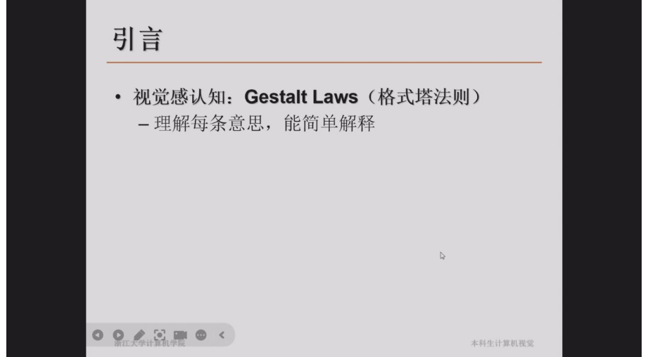

- Law of Proximity: 近距离的元素会被感知为一个整体
- Law of Similarity: 相似的元素会被感知为一个整体
- Law of Closure: 不完整的形状会被感知为完整的形状
- Law of Continuity: 连续的线条或曲线更容易被感知为一个整体
- Good form: 简单、对称、平衡的形状更容易被感知为一个整体
- Law of Figure/Ground: 前景和背景的区分会影响感知

## 边缘

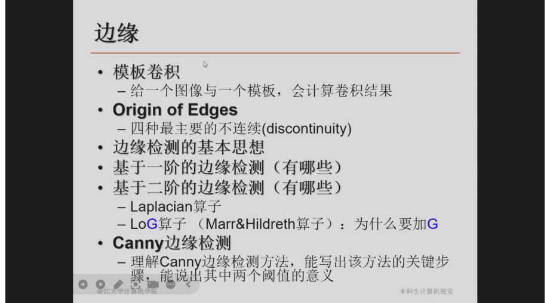

### 四种最主要的不连续

- 深度不连续
- 表面方向不连续
- 表面反射率不连续
- 光照不连续

### 边缘检测基本思想

一阶导数的极值点，二阶导数的零点

#### 一阶导算子

- Roberts算子
- Sobel算子
- Prewitt算子

### 二阶导算子

- Laplacian算子
- Laplacian of Gaussian (LoG)算子：为什么要加G?

为了解决拉普拉斯算子对噪声敏感的问题，Marr和Hildreth提出先用高斯滤波器（G）对图像进行平滑处理以抑制噪声，然后再应用拉普拉斯算子（L）检测边缘。这就是 LoG (L of G) 的由来。这个过程可以有效地找到在特定尺度下的“真实”边缘。

### Canny边缘检测

1. 高斯滤波：使用高斯滤波器平滑图像，减少噪声。
-  计算梯度：使用Sobel算子计算图像的梯度幅值和方向。梯度方向公式为$\theta = \arctan(\frac{G_y}{G_x})$，其中$G_x$和$G_y$分别是图像在x和y方向的梯度。
- 非极大值抑制：沿梯度方向抑制非极大值，保留局部最大值。
- 双阈值处理：使用高低阈值确定强边缘和弱边缘。高阈值
  的像素被认为是强边缘，低阈值的像素被抑制。高低之间的像素被认为是弱边缘。
  - 边缘连接：通过连接强边缘和弱边缘，形成完整的边缘。

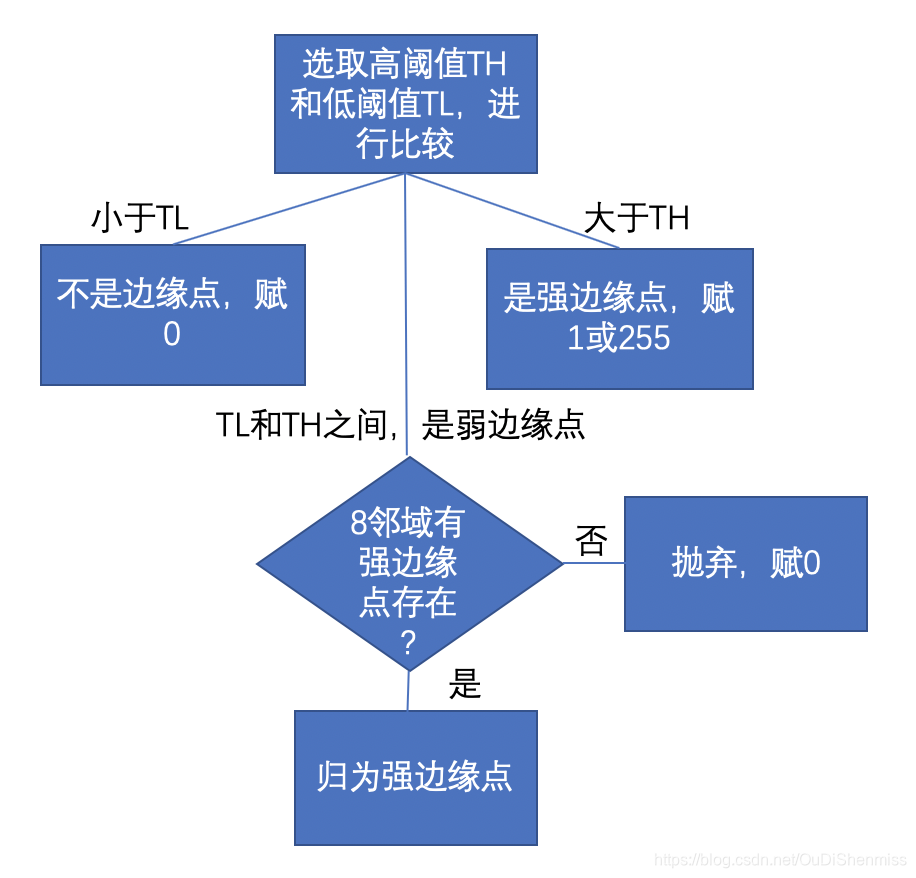

## Hough 变换

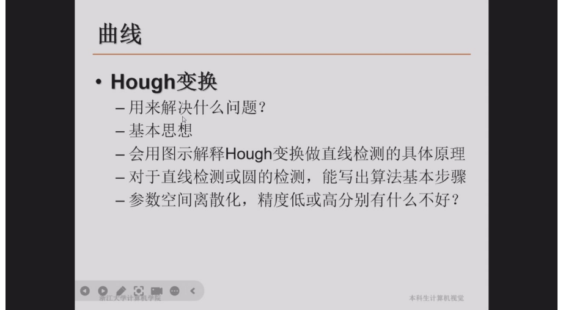

#### 用来解决什么问题？

霍夫变换主要解决**在图像中识别和定位几何形状**的问题。它的最大优点是**对噪声和物体边界的不完整性（断裂、遮挡）具有很强的鲁棒性**。

#### 基本思想

霍夫变换的基本思想是**利用“投票”机制，将图像空间中的形状检测问题，转换到参数空间中寻找峰值点的问题**。

- **图像空间 (Image Space)**: 我们通常看到的包含像素的 $(x, y)$ 坐标系。
- **参数空间 (Parameter Space)**: 一个用来描述几何形状参数的空间。例如，一条直线可以用斜率 $m$ 和截距 $c$ 来定义，那么 $(m, c)$ 就是一个参数空间。

图像空间中的一个点，对应到参数空间中是满足该点位置的所有可能形状的集合（一条曲线）。反之，参数空间中的一个点，则对应图像空间中的一个特定形状。如果图像空间中的多个点共线（或共圆），那么它们在参数空间中对应的曲线将会交于一点。这个交点的"得票数"就会很高，成为一个峰值，从而代表了被检测出的形状。

#### **3. 用图示解释Hough变换做直线检测的具体原理**

直线检测是霍夫变换最经典的应用。

1.  **直线的参数表示**: 在笛卡尔坐标系中，直线方程是 $y = mx + c$。但当直线垂直时，斜率 $m$ 为无穷大，无法表示。为了解决这个问题，霍夫变换采用**极坐标**来表示直线：
    $$\rho = x \cos\theta + y \sin\theta$$

- $\rho$ (rho): 原点到直线的垂直距离。
- $\theta$ (theta): 该垂直线的角度。
-  使用这种表示法，任何直线都可以由唯一的 $(\rho, \theta)$ 对来表示。

1.  **空间转换**:

-**图像空间中的一个点 $(x_0, y_0)$**：经过这个点的所有可能的直线，在 $(\rho, \theta)$ 参数空间中会形成一条**正弦曲线**：$\rho = x_0 \cos\theta + y_0 \sin\theta$。

- **图像空间中的多个共线点**: 如下图所示，图像空间中的点 $P_1$, $P_2$, $P_3$ 在同一条直线上。将它们各自映射到 $(\rho, \theta)$ 参数空间，会得到三条不同的正弦曲线。

- **关键点**: 这三条正弦曲线会**相交于同一点 $(\rho_0, \theta_0)$**。这个交点就代表了图像空间中那条同时穿过 $P_1$, $P_2$, $P_3$ 的直线。

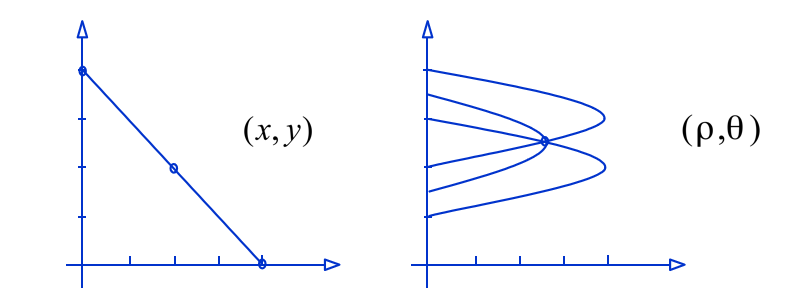
  
 **投票与检测**: 我们创建一个二维数组（称为**累加器**或 Accumulator），横轴是 $\theta$，纵轴是 $\rho$。对于图像中的每一个边缘点，我们计算出它在参数空间对应的整条正弦曲线，并对曲线上经过的每一个累加器单元格进行"投票"（计数值加1）。遍历完所有边缘点后，累加器中计数值最高的单元格（峰值点），其对应的 $(\rho, \theta)$ 值就定义了图像中最显著的直线。

#### 对于直线检测或圆的检测，能写出算法基本步骤

**直线检测算法步骤**:

1.  **边缘检测**: 首先使用 Canny 等边缘检测算法找到图像中的所有边缘点。这是因为直线通常是由边缘构成的。
2.  **创建累加器**: 创建一个二维数组（累加器），用于在参数空间 $(\rho, \theta)$ 中投票。根据所需的精度确定 $\rho$ 和 $\theta$ 的范围和步长（离散化）。

3.  **投票过程**:
      * 遍历每一个边缘点 $(x, y)$。
      * 对于每个点，遍历所有可能的角度 $\theta$（例如，从 $0°$ 到 $180°$）。
      * 根据公式 $\rho = x \cos\theta + y \sin\theta$ 计算出对应的 $\rho$ 值。
      * 在累加器中，找到 $(\rho, \theta)$ 对应的单元格，并将其计数值加 1。
4.  **寻找峰值**: 遍历累加器，找到计数值超过某一阈值的单元格。这些峰值点 $(\rho_i, \theta_i)$ 就对应着图像中检测到的显著直线。

**圆的检测算法步骤**:

圆的方程为 $(x - a)^2 + (y - b)^2 = r^2$，参数有三个 $(a, b, r)$。

1.  **边缘检测**: 同直线检测。
2.  **创建累加器**: 创建一个**三维**累加器，用于在参数空间 $(a, b, r)$ 中投票。
3.  **投票过程**:
      * 遍历每一个边缘点 $(x, y)$。
      * 对于每个点，遍历所有可能的圆心 $(a, b)$（或者所有可能的半径 $r$，取决于具体实现）。
      * 根据 $r = \sqrt{(x - a)^2 + (y - b)^2}$ 计算出参数。
      * 在累加器中，对 $(a, b, r)$ 对应的单元格投票。
      * *(注：三维霍夫变换计算量和内存消耗巨大，通常会通过利用梯度的方向等信息进行优化)*
4.  **寻找峰值**: 在三维累加器中寻找计数值超过阈值的峰值点 $(a_i, b_i, r_i)$，它们就代表了检测到的圆。

#### 参数空间离散化，精度低或高分别有什么不好？

参数空间的离散化（即将 $\rho$, $\theta$, $r$ 等参数划分为多少个"格子"）是一个重要的权衡：

  * **精度过低（格子粗糙）**:

      * **缺点**:
        1.  **结果不精确**: 检测出的直线或圆的位置、大小参数与真实值有较大偏差。
        2.  **合并不同物体**: 图像中两条靠得很近但不同的直线，可能会被投票到同一个粗糙的累加器格子中，导致它们被错误地识别为一条直线。

  * **精度过高（格子精细）**:

      * **缺点**:
        1.  **计算量和内存巨大**: 累加器数组的尺寸会变得非常大，导致投票过程耗时很长，且占用大量内存。
        2.  **投票分散**: 由于数字图像中像素的离散性和噪声影响，本应属于同一条直线的点，其计算出的 $(\rho, \theta)$ 值会有微小差异。如果格子太精细，这些票会分散到邻近的多个格子中，导致没有一个格子的票数能够突出地形成峰值，反而降低了检测的稳定性。
        3.  **产生虚假峰值**: 容易受到噪声影响，产生许多无意义的局部峰值。

## Local Feature 

好的，这张幻灯片接续之前的内容，深入探讨了计算机视觉中的 **局部特征 (Local Feature)**。局部特征是指图像中具有独特性、能够被稳定识别的点或区域，如角点、斑点等。它们是实现图像匹配、物体识别、三维重建等高级任务的基础。

这张幻众片主要围绕两种著名的局部特征算法展开：**Harris 角点检测** 和 **SIFT 特征**。

---

## **局部特征 (Local Feature)**

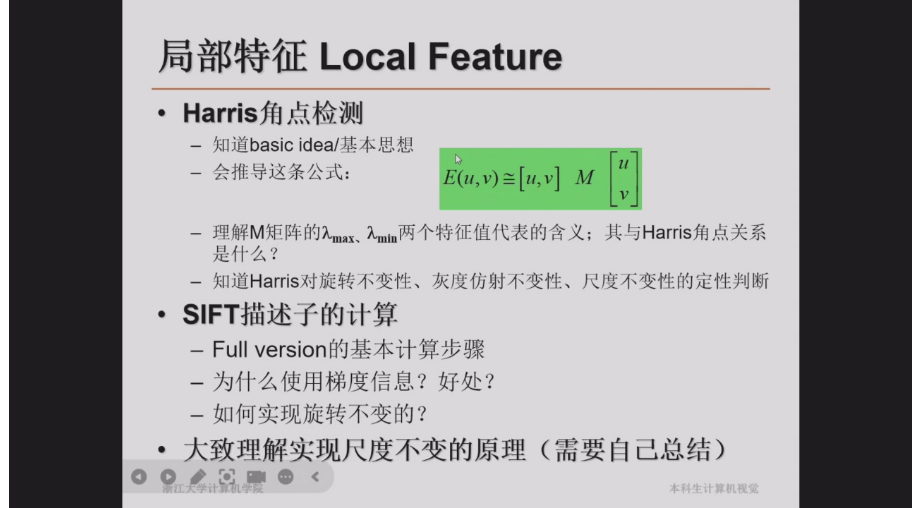

### • Harris角点检测 (Harris Corner Detection)

Harris 角点检测是一种经典且快速的特征点提取算法，专门用于寻找图像中的“角点”。

#### **1. 知道basic idea/基本思想**

Harris 角点的基本思想是：**通过一个小的滑动窗口，观察窗口在各个方向上移动时，窗口内像素强度的变化情况。**
* **平坦 (Flat) 区域**: 无论窗口朝哪个方向移动，窗口内的像素强度基本没有变化。
* **边缘 (Edge) 区域**: 当窗口沿着边缘方向移动时，强度变化不大；但当窗口垂直于边缘方向移动时，强度会发生剧烈变化。
* **角点 (Corner) 区域**: 无论窗口朝任何方向移动，窗口内的像素强度都会发生显著变化。

Harris 角点检测正是要找到这些在所有方向上强度变化都很大的点。

#### **2. 会推导这条公式**

这条公式是用来量化窗口移动时像素强度变化的。
* **$E(u, v)$**：表示窗口向 $(u, v)$ 方向移动 $(u, v)$ 距离后，窗口内像素强度的**变化量之和** (Sum of Squared Differences, SSD)。
* **推导过程**：
    1.  设原始图像在位置 $(x, y)$ 的强度为 $I(x, y)$，滑动窗口为 $w$。
    2.  当窗口从 $(x, y)$ 移动到 $(x+u, y+v)$ 时，强度变化为 $I(x+u, y+v) - I(x, y)$。
    3.  $E(u, v)$ 就是对整个窗口内的所有像素点计算这个强度变化的平方和：
        $$E(u, v) = \sum_{(x,y) \in w} [I(x+u, y+v) - I(x, y)]^2$$
    4.  对于微小的移动 $(u, v)$，$I(x+u, y+v)$ 可以通过泰勒展开近似为 $I(x, y) + uI_x + vI_y$，其中 $I_x$ 和 $I_y$ 分别是图像在 x 和 y 方向的偏导数（梯度）。
    5.  代入上式，得到：
        $$E(u, v) \approx \sum_{(x,y) \in w} [uI_x + vI_y]^2 = \sum_{(x,y) \in w} (u^2I_x^2 + 2uvI_xI_y + v^2I_y^2)$$
    6.  将求和项与 $(u, v)$ 分离，并写成矩阵形式，就得到了最终的公式：
        $$E(u, v) \approx \begin{bmatrix} u & v \end{bmatrix} \left( \sum_{(x,y) \in w} \begin{bmatrix} I_x^2 & I_xI_y \\ I_xI_y & I_y^2 \end{bmatrix} \right) \begin{bmatrix} u \\ v \end{bmatrix}$$
    7.  其中，中间的那个 2x2 矩阵就是 **M 矩阵**：
        $$M = \begin{bmatrix} \sum I_x^2 & \sum I_xI_y \\ \sum I_xI_y & \sum I_y^2 \end{bmatrix}$$

#### **3. 理解M矩阵的 $\lambda_{max}$、$\lambda_{min}$ 两个特征值的含义，其与Harris角点关系是什么？**
矩阵 $M$ 描述了窗口内梯度的分布情况。它的两个特征值 $\lambda_{max}$ 和 $\lambda_{min}$ 直观地反映了在两个相互垂直的方向上（特征向量方向），窗口强度变化的大小。

* **关系与含义**:
    * **平坦区域**: 梯度很小，所以两个特征值 $\lambda_{max}$ 和 $\lambda_{min}$ 都很小。
    * **边缘区域**: 只有一个方向梯度变化大，所以 $\lambda_{max}$ 很大，而 $\lambda_{min}$ 很小。
    * **角点区域**: 所有方向梯度变化都很大，所以 $\lambda_{max}$ 和 $\lambda_{min}$ 都很大。

为了避免直接计算特征值（计算量大），Harris 算法定义了一个角点响应函数 $R$：
$$R = \det(M) - k(\text{trace}(M))^2 = \lambda_{max}\lambda_{min} - k(\lambda_{max} + \lambda_{min})^2$$
其中 $k$ 是一个经验常数（通常取 0.04 ~ 0.06）。通过 $R$ 值就可以判断一个点是否是角点：

* **$R$ 很大**: 是角点（因为 $\lambda_{max}$ 和 $\lambda_{min}$ 都很大）。
* **$R$ 为负数且绝对值很大**: 是边缘（因为 $\lambda_{max} \gg \lambda_{min}$）。
* **$R$ 的绝对值很小**: 是平坦区域。

#### **4. 知道Harris对旋转不变性、灰度仿射不变性、尺度不变性的定性判断**

* **旋转不变性 (Rotation Invariant)**: **是**。因为矩阵 $M$ 的特征值在坐标系旋转后保持不变，所以角点响应函数 $R$ 的值也不变。因此 Harris 角点是旋转不变的。
* **灰度仿射不变性 (Intensity Affine Invariant)**:
    * 对**亮度变化** ($I' = I + b$) **不变**，因为计算中只用到了梯度 $I_x$, $I_y$，常数项 $b$ 在求导后消失。
    * 对**对比度变化** ($I' = aI$) **不完全不变**，因为梯度会变为 $aI_x$, $aI_y$，这会导致 $R$ 值变为原来的 $a^4$ 倍。虽然 $R$ 值的大小变了，但在很多情况下仍然可以被检测到（因为阈值也会相应调整），所以具有一定的鲁棒性。
* **尺度不变性 (Scale Invariant)**: **否**。Harris 角点检测器使用的是固定大小的滑动窗口。当图像尺度变化时，原来的"角点"在新的尺度下可能看起来像"边缘"或"平坦区域"。例如，一个小的角点放大后，窗口可能只覆盖了它的一条边，从而将其误判为边缘。

### SIFT描述子的计算 (SIFT Descriptor Calculation)

#### Full version的基本计算步骤

完整的 SIFT 算法包含四个主要步骤：
1.  **尺度空间极值检测 (Scale-space Extrema Detection)**: 通过构建高斯差分 (Difference-of-Gaussian, DoG) 金字塔，在不同尺度上寻找对尺度和位置都不变的候选特征点。
2.  **关键点精确定位 (Keypoint Localization)**: 对候选点进行拟合，剔除对比度低和不稳定的边缘点，得到稳定且精确定位的关键点。
3.  **方向分配 (Orientation Assignment)**: 为每个关键点计算一个或多个主方向。方法是计算关键点邻域内像素的梯度方向直方图，取直方图的峰值作为主方向。**这一步是实现旋转不变性的关键**。
4.  **关键点描述子生成 (Keypoint Descriptor Generation)**:
    * 将关键点周围的区域旋转到其主方向。
    * 在该区域上划分一个 4x4 的网格。
    * 在每个小格子里，计算 8 个方向的梯度方向直方图。
    * 将这 16 个小格子的直方图拼接起来，形成一个 16 * 8 = 128 维的向量，这个向量就是 SIFT 描述子。

#### 为什么使用梯度信息？好处？

使用梯度信息（梯度大小和方向）而不是直接使用像素强度，有以下核心好处：

* **对光照变化不敏感**: 梯度主要描述的是像素强度变化的模式和方向，而不是其绝对值。当图像整体亮度发生变化时（如 `I' = I + b`），梯度保持不变。当对比度变化时（`I' = aI`），梯度的方向不变，大小按比例缩放，在后续的描述子归一化步骤中，这种影响也会被消除。这使得 SIFT 描述子对光照变化非常鲁棒。
* **捕捉结构信息**: 梯度能够有效地捕捉物体边缘和纹理的局部结构信息，这种结构信息比单个像素的强度值更具描述性。

#### 如何实现旋转不变的？

SIFT 通过**方向分配**和**坐标系对齐**来实现旋转不变性。

1.  **分配主方向**: 在为关键点生成描述子之前，SIFT 先计算该关键点邻域内所有像素的梯度方向，并创建一个方向直方图。直方图的峰值就代表了该区域的**主方向**。
2.  **旋转坐标系**: 在生成 128 维描述子时，不是在原始的图像坐标系中采样，而是先将坐标系**旋转**一个角度，使其与上一步计算出的主方向对齐。
3.  **相对采样**: 之后所有的梯度方向计算都是相对于这个新的、对齐后的坐标系进行的。

这样一来，无论原始图像如何旋转，算法总能找到这个特征点的主方向，并将描述子坐标系与之对齐，最终生成的 128 维描述子向量因此是不变的。

### 大致理解实现尺度不变的原理 (需要自己总结)

SIFT 实现尺度不变性的核心在于其**尺度空间金字塔**的构建和搜索。

1.  **模拟不同尺度**: SIFT 首先对原始图像进行多次高斯平滑（模糊），并进行降采样，生成一系列不同尺寸、不同模糊程度的图像。这个图像集合被称为“高斯金字塔”。它模拟了我们在不同距离（即不同尺度）观察物体的效果。
2.  **寻找尺度不变的响应**: 通过计算相邻高斯平滑图像之间的差分（高斯差分，DoG），来寻找在尺度上稳定的响应点。一个点如果在 DoG 空间的某个尺度层上成为局部极值点，就意味着它在该尺度下是一个显著的特征点（斑点）。
3.  **记录特征尺度**: 当一个关键点被检测出来时，它所在的金字塔层级就定义了它的“**特征尺度**”。
4.  **尺度归一化描述**: 在生成描述子时，采样区域的大小是根据该关键点的**特征尺度**来确定的。例如，一个在较大尺度上检测到的点，其采样邻域也相应较大。

**总结**: SIFT 

## 图像拼接

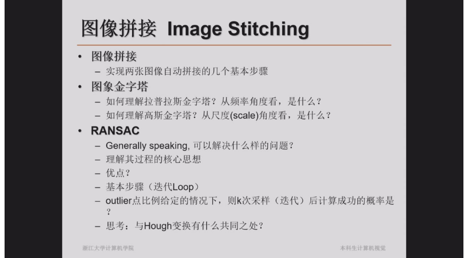

### 图像拼接的步骤

### 图像拼接的步骤

图像拼接是将多个具有重叠视野的图像组合成单个高分辨率全景图像的过程。

#### 实现两张图像自动拼接的几个基本步骤

1. **特征点检测**: 首先在两幅图像中识别出显著的关键点。这些点需要能在尺度或旋转变化下在两幅图像中可靠地找到。常用的算法包括SIFT、SURF或Harris角点检测器。

2. **特征描述**: 为每个关键点创建一个紧凑的数值描述子,用于总结该点周围局部图像区域的特征。SIFT描述子是一个经典选择,因为它对光照、尺度和旋转变化都具有很强的鲁棒性。

3. **特征匹配**: 比较两幅图像中的描述子,找到对应点对。通常通过在另一幅图像的描述子集合中寻找"最近邻"来完成。

4. **变换矩阵估计**: 使用匹配的关键点对来计算将一幅图像对齐到另一幅图像的几何变换。对于平面表面的图像或从同一旋转点拍摄的图像,这个变换是一个单应性矩阵(3x3矩阵)。由于错误匹配(离群点)很常见,这里几乎总是使用RANSAC算法来从含噪声的匹配集中稳健地估计单应性矩阵。

5. **图像变形与融合**:
   * 变形: 将估计的单应性矩阵应用于其中一幅图像,使其变形到另一幅图像的视角。
   * 融合: 最后,对变形图像和参考图像的重叠区域进行像素混合,创建无缝过渡。通常使用图像金字塔(特别是拉普拉斯金字塔)来实现平滑混合。

### 图像金字塔

图像金字塔是图像的多尺度表示,通过重复平滑和降采样创建。它是需要在多个尺度上操作的任务(如混合和特征检测)的关键工具。

#### 拉普拉斯金字塔的理解

从频率角度看,拉普拉斯金字塔是一系列带通滤波后的图像集合。金字塔的每一层都捕获了特定频带内的图像细节。

它是通过高斯金字塔中的一层与其上一层上采样版本之间的差异构建的。这种差异隔离了在模糊和降采样过程中丢失的细节(高频信息)。当你堆叠这些差异图像时,就得到了一个将图像分成不同"频带"细节的表示,从粗糙到精细。这个特性使其非常适合图像混合,因为你可以分别混合不同频带以避免可见的接缝。

#### 高斯金字塔的理解

从尺度角度看,高斯金字塔是图像的多尺度表示,展示了图像在不同分辨率或尺度下的样子。

它从原始图像(第0层)开始构建,然后重复应用高斯模糊和降采样(如将图像尺寸减半)来创建下一层。结果是一堆大小递减的图像,其中每一层都是下面一层的更平滑、更低分辨率的版本。这对于找到可能以不同大小(尺度)出现在图像中的特征很有用,就像在SIFT算法中所做的那样。

### RANSAC算法

RANSAC代表随机样本一致性(RANdom SAmple Consensus)。它是在存在噪声和离群点情况下进行模型拟合的重要算法。

#### 可以解决什么样的问题？

RANSAC设计用于解决在数据包含大量离群点的情况下拟合数学模型的问题。例如,当你有两幅图像之间的一组匹配点来寻找直线或单应性矩阵时,许多匹配可能是不正确的(离群点)。RANSAC可以通过忽略这些离群点来找到正确的模型参数。

#### 核心思想

RANSAC的核心思想是一个迭代的、基于投票的过程："如果我们能找到一个与大部分数据一致的模型,那么这个模型很可能是正确的。"

它假设数据由内点(可以被模型解释的数据点)和离群点(不符合模型的数据点)组成。RANSAC不是试图一次使用所有数据,而是随机选择最小可能的数据点子集来估计模型。然后检查有多少其他点与这个模型一致。重复这个过程,获得最多"投票"(即有最多内点)的模型被选为最终答案。

#### 优点

RANSAC的主要优点是其鲁棒性。它可以容忍数据中很大比例的离群点(高达50%或更多)并仍然产生良好的模型拟合,而传统方法如最小二乘法则会完全失败。

#### 基本步骤(迭代Loop)

1. **采样**: 随机选择拟合模型所需的最小数据点数。(例如,直线需要2个点,单应性矩阵需要4对点)
2. **估计**: 仅使用这个最小样本计算模型参数。(例如,计算直线方程或单应性矩阵)
3. **评分**: 计算在预定义容差(阈值)内符合估计模型的其他数据点数量。这些是该迭代的"内点",它们的数量是模型的得分。
4. **评估**: 如果当前模型的得分是迄今最高的,保存这个模型及其内点集作为最佳估计。
5. **重复**: 重复步骤1-4固定次数(k)。

循环结束后,通常使用所有识别出的内点重新估计最佳模型以获得更准确的结果。

#### 采样成功概率计算

给定离群点比例e,k次采样(迭代)后计算成功的概率可以计算。

设:
设:
- $e$ = 数据中离群点的比例
- $w = 1 - e$ = 内点的比例
- $s$ = 拟合模型需要的最小点数
- $k$ = 迭代次数

一次选中$s$个内点的概率是$w^s$。
一次选择失败(即至少选中一个离群点)的概率是$1 - w^s$。
$k$次独立迭代全部失败的概率是$(1 - w^s)^k$。
因此,$k$次迭代后成功(至少成功一次)的概率是:

$P(成功)=1-(1-w^s)^k=1-(1-(1-e)^s)^k$

这个公式对于确定达到期望成功率(如99.9%)所需的迭代次数($k$)很重要。

#### 与Hough变换的共同之处

RANSAC和Hough变换共享一个基本的核心思想:

1. **基于投票的机制**: 两种算法都通过让数据点为模型参数"投票"来工作。在Hough变换中,点在累加器数组中为参数投票。在RANSAC中,随机样本提出一个模型,内点通过拟合它来"投票"。

2. **对噪声/离群点的鲁棒性**: 两种算法都设计为对噪声和离群点具有高度鲁棒性。它们通过寻找数据点之间的共识而不是被坏数据影响来找到全局结构。

3. **参数空间搜索**: 两者都将问题从数据空间转换到模型参数空间。目标是在这个参数空间中找到一个"峰值"或"高密度区域",这对应于最佳模型。

## 主元分析与人脸识别

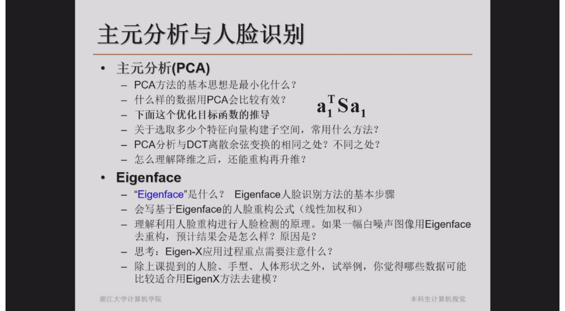

### **主元分析 (PCA, Principal Component Analysis)**

PCA 是一种广泛应用的线性降维方法，其核心目标是在保留数据最多信息的前提下，用更少的特征来表示数据。

#### **1. PCA方法的基本思想是最小化什么？**

PCA 的基本思想可以从两个角度理解，它们是等价的：
* **最大化投影方差**：寻找一组新的正交基（主成分），使得原始数据投影到这组基上之后，方差最大。方差越大，代表保留的原始信息越多。
* **最小化重构误差**：寻找一个低维超平面，使得所有原始数据点到这个超平面的投影距离（即重构误差）之和最小。

PCA的基本思想是**最小化重构误差 (Minimizing Reconstruction Error)**。

#### **2. 什么样的用数据PCA会比较有效？**

PCA 在处理**高维且变量之间存在强线性相关性**的数据时最有效。当数据中的多个变量高度相关时，意味着存在信息冗余。PCA通过线性变换找到一组新的、不相关的变量（主成分），从而消除这种冗余，实现有效降维。
例如：人脸图像（所有像素点高度相关）、高光谱图像、基因表达数据等。

#### **3. 下面这个优化目标函数的推导**

幻灯片中的公式应为最大化目标：$\max a_1^T S a_1$

* **$S$** 是数据的**协方差矩阵**，它描述了数据各个维度之间的相关性。
* **$a_1$** 是第一个主成分的方向向量（单位向量）。
* **$a_1^T S a_1$** 的物理意义是**原始数据投影到 $a_1$ 方向上的方差**。

* **推导思路**：PCA的目标是找到一个方向 $a_1$，使得投影方差最大。
这是一个约束优化问题（约束为 $\|a_1\|=1$）。通过拉格朗日乘子法可以证明，
能使该式取得最大值的向量 $a_1$ **必须是协方差矩阵 $S$ 的最大特征值所对应的特征向量**。

#### **4. 关于选取多少个特征向量构建子空间，常用什么方法？**
选择 `k` 个特征向量（即降维到 `k` 维）的常用方法有：
1.  **能量百分比法 (Percentage of Energy)**：设定一个能量保留阈值（如90%、95%），然后选择前 `k` 个特征值，使得它们的总和占所有特征值总和的比例达到该阈值。公式为：
    $$\frac{\sum_{i=1}^k \lambda_i}{\sum_{i=1}^n \lambda_i} \ge \text{Threshold}$$
2.  **碎石图法 (Scree Plot)**：将所有特征值按从大到小的顺序绘制成图表，观察曲线的“拐点”（Elbow Point）。通常选择“拐点”之前的所有特征向量，因为“拐点”之后特征值下降趋于平缓，说明这些特征向量包含的信息较少。

#### **5. PCA分析与DCT离散余弦变换的相同之处？不同之处？**
* **相同之处**：
    * 两者都是线性变换，可以将信号或图像的能量集中在少数几个系数上。
    * 都常用于数据压缩和降维。
* **不同之处**：
    * **数据依赖性**：**PCA 是数据依赖的**，其基向量（特征向量）是从特定训练数据的统计特性（协方差矩阵）中计算出来的。对于不同的数据集，PCA的基向量也不同。而 **DCT 是数据独立的**，其基函数（余弦函数）是固定的。
    * **最优性**：对于给定的数据集，PCA 是理论上最优的（均方误差最小）线性变换。DCT 则是对“自然信号”（如图像块）的一个非常好的近似，但不是严格最优的。

#### **6. 怎么理解降维之后，还能重构再升维？**
* **降维**：是将原始的高维数据点投影到由前 `k` 个特征向量构成的低维子空间上，得到一组低维坐标。
* **重构（升维）**：是用这组低维坐标作为权重，对那 `k` 个高维的特征向量基进行线性组合。
    $$\text{Image}_{\text{reconstructed}} = \sum_{i=1}^k w_i \cdot \text{Eigenvector}_i + \text{Mean}$$
    这个重构后的图像是在原始高维空间中的一个点，但它完全位于那个低维子空间内。因此，它只是对原始图像的一个**近似**，其与原始图像的差异就是重构误差。

### **Eigenface (特征脸)**

Eigenface 是将 PCA 应用于人脸识别的经典方法。

#### **1. "Eigenface"是什么？Eigenface人脸识别方法的基本步骤**
* **"Eigenface"**：直译为“特征脸”。它指的是从一个人脸图像数据集中计算出的**协方差矩阵的特征向量**。这些特征向量本身看起来像一张张模糊、诡异的人脸，它们构成了描述所有人脸的“脸空间”(Face Space) 的基。
* **基本步骤**：
    1.  **数据准备**：收集大量对齐好的人脸图像作为训练集。
    2.  **计算平均脸**：计算所有训练图像的平均值，得到“平均脸”。
    3.  **计算特征脸**：将每张人脸图像减去平均脸，然后计算这组数据的协方差矩阵，并求其特征值和特征向量（即Eigenfaces）。选取前 `k` 个最大的特征值对应的特征向量作为基。
    4.  **人脸表示**：将每一张已知身份的人脸（训练集中的）投影到由特征脸构成的子空间中，得到一组 `k` 维的权重向量，存入数据库。
    5.  **人脸识别**：对于一张新的待识别人脸，同样将其投影到该子空间得到其权重向量，然后与数据库中所有已知权重向量进行比较（如计算欧氏距离），距离最近的即为识别结果。

#### **2. 会写基于Eigenface的人脸重构公式 (线性加权和)**
设待重构人脸向量为 $ \Phi $，平均脸为 $ \Psi $，第 $i$ 个特征脸为 $u_i$。
1.  首先计算投影权重：$ w_i = u_i^T (\Phi - \Psi) $
2.  然后进行线性加权和重构：
    $$\Phi' = \Psi + \sum_{i=1}^k w_i u_i$$
    其中 $\Phi'$ 就是重构后的人脸图像。

#### **3. 理解利用人脸重构进行人脸检测的原理**

原理基于**重构误差**的大小。
* 如果一个图像块确实是**人脸**，那么它应该“位于”或“接近于”由Eigenfaces张成的“脸空间”。因此，用Eigenface基对其进行重构后，得到的图像会与原始图像非常相似，**重构误差很小**。
* 如果一个图像块是**非人脸**（如幻灯片中的`白噪声`或更实际的`风景照`），它离“脸空间”很远。用Eigenface基强行重构它，结果会面目全非，与原始图像差异巨大，**重构误差很大**。
* 因此，通过在图像上滑动一个窗口，并计算每个窗口的重构误差，误差小的区域就可以被认为是人脸。

#### **4. 思考：Eigen-X应用过程重点需要注意什么？**

"Eigen-X"指将此方法应用于其他物体（如手、身体、字母等）。重点注意事项：
1.  **严格的对齐和归一化**：训练集中的所有样本必须在空间上严格对齐（如人脸的眼睛、鼻子在相同位置）并且尺寸一致。
2.  **光照敏感**：PCA对光照变化非常敏感。训练集应包含多种光照条件，或在预处理阶段进行光照校正（如直方图均衡化）。
3.  **姿态和表情敏感**：该方法难以处理大的姿态和表情变化。通常只对特定姿态（如正面）有效。
4.  **背景处理**：背景需要尽量保持一致或在预处理时将其移除，否则背景会作为噪声影响特征脸的计算。

#### **5. 试举例，你觉得哪些数据可能比较适合用EigenX方法去建模？**
除了人脸、手型、人体形状外，其他适合的数据应具有**固定的、标准化的结构**。
* **手写数字识别**：例如MNIST数据集，每个数字的结构相对固定。
* **特定物体的工业质检**：例如检测标准型号的螺丝钉，它们的外形高度一致。
* **生物医学图像**：例如特定角度下的某种细胞、器官（如大脑MRI切片）的形态分析。
* **特定风格的艺术品分类**：例如分析某位画家的笔触或构图特征。

## 光流Optical Flow

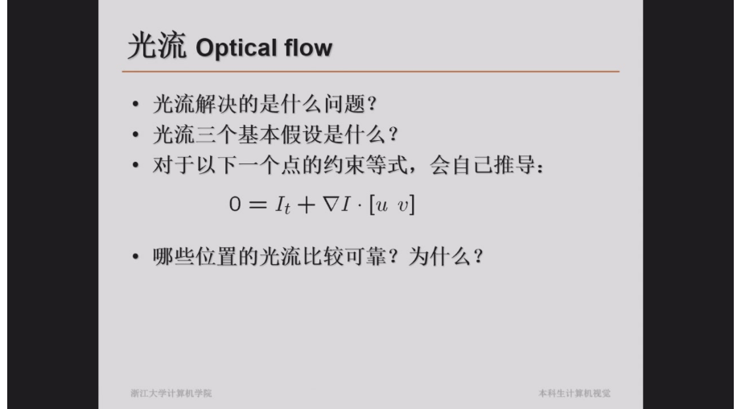

### **1. 光流解决的是什么问题？**

光流旨在解决**估计图像中每个像素瞬时运动速度和方向**的问题。

简单来说，当场景中的物体移动或相机移动时，图像上的亮度模式（像素灰度）也会随之移动。光流就是描述这种亮度模式在连续两帧图像之间“看起来”移动的速度和方向的**二维向量场**。

它的主要应用包括：
* **物体跟踪**：跟踪视频中的特定目标。
* **运动分割**：根据运动模式将图像中的前景（运动物体）和背景分离。
* **视频压缩**：通过预测下一帧的运动来减少需要存储的数据量。
* **机器人导航**：帮助机器人理解自身运动（Ego-motion）和环境中物体的运动，从而实现避障。
* **三维重建**：从运动中恢复场景的三维结构（Structure from Motion, SfM）。

### **2. 光流三个基本假设是什么？**

几乎所有的光流估计算法都建立在以下三个基本假设之上：

1.  **亮度恒定 (Brightness Constancy)**：这是最核心的假设。它假定在一个移动的物体上，某个点的亮度（像素灰度值）在连续的两帧之间是保持不变的。
    * 数学表达为：$I(x, y, t) = I(x + \delta x, y + \delta y, t + \delta t)$

2.  **时间连续性 / 小运动 (Small Motion)**：假设两帧之间的时间间隔很短（$ \delta t \to 0 $），因此像素的运动位移（$ \delta x, \delta y $）也非常小。这个假设是使用泰勒级数展开来线性化问题的数学基础。

3.  **空间一致性 (Spatial Coherence)**：假设一个局部邻域内的像素点具有相似的运动。即一个小的图像块（patch）内的像素作为一个整体在移动，它们的光流向量是相同或相似的。这个假设有助于解决“孔径问题”，并为求解光流提供额外的约束。

### **3. 对于以下一个点的约束等式，会自己推导： $0 = I_t + \nabla I \cdot [u \ v]$**

这个公式被称为**光流约束方程（Optical Flow Constraint Equation）**，其推导过程如下：

1.  根据**亮度恒定假设**，我们有：
    $I(x, y, t) = I(x + \delta x, y + \delta y, t + \delta t)$

2.  根据**小运动假设**，我们可以对上式右侧进行一阶泰勒级数展开：
    $I(x + \delta x, y + \delta y, t + \delta t) \approx I(x, y, t) + \frac{\partial I}{\partial x}\delta x + \frac{\partial I}{\partial y}\delta y + \frac{\partial I}{\partial t}\delta t$

3.  将展开式代入第一步的等式中，两边的 $I(x, y, t)$ 项相互抵消，得到：
    $0 \approx \frac{\partial I}{\partial x}\delta x + \frac{\partial I}{\partial y}\delta y + \frac{\partial I}{\partial t}\delta t$

4.  将上式两边同时除以时间间隔 $\delta t$：
    $0 \approx \frac{\partial I}{\partial x}\frac{\delta x}{\delta t} + \frac{\partial I}{\partial y}\frac{\delta y}{\delta t} + \frac{\partial I}{\partial t}$

5.  定义光流向量 $(u, v)$ 和图像偏导数：
    * $u = \frac{\delta x}{\delta t}$ （x方向的速度）
    * $v = \frac{\delta y}{\delta t}$ （y方向的速度）
    * $I_x = \frac{\partial I}{\partial x}$ （图像在x方向的梯度）
    * $I_y = \frac{\partial I}{\partial y}$ （图像在y方向的梯度）
    * $I_t = \frac{\partial I}{\partial t}$ （图像随时间变化的梯度）

6.  将这些定义代入，得到光流约束方程的标量形式：
    $I_x u + I_y v + I_t = 0$

7.  写成向量形式，令图像空间梯度为 $\nabla I = \begin{bmatrix} I_x \\ I_y \end{bmatrix}$，光流向量为 $\begin{bmatrix} u \\ v \end{bmatrix}$，则方程为：
    $$\nabla I^T \begin{bmatrix} u \\ v \end{bmatrix} + I_t = 0 \quad \text{或} \quad \nabla I \cdot \begin{bmatrix} u \\ v \end{bmatrix} + I_t = 0$$
    这与幻灯片上的公式形式一致。

### **4. 哪些位置的光流比较可靠？为什么？**

**回答：** 在 **角点（Corners）** 和 **纹理丰富（Textured）** 的位置，光流的计算比较可靠。

**原因：** 这与著名的**孔径问题（Aperture Problem**有关。

* **孔径问题**：光流约束方程 $I_x u + I_y v = -I_t$ 是一个只有一个方程但有两个未知数（`u` 和 `v`）的线性方程，因此无法直接求解。如果你只观察一个小的局部窗口（孔径），对于一条移动的直线边缘，你只能确定垂直于该边缘方向的运动分量，而无法确定沿着边缘方向的运动分量。

* **平坦区域 (Flat Regions)**：在这些区域，$I_x$ 和 $I_y$ 都接近于0，光流约束方程退化为 $I_t \approx 0$，无法提供任何关于运动 `(u, v)` 的信息。

* **边缘区域 (Edge Regions)**：在这些区域，图像梯度只在一个方向上显著（例如，垂直于边缘的方向），而在平行于边缘的方向上梯度为0。这导致我们只能确定一个运动分量，存在无穷多组解。

* **角点和纹理丰富区域 (Corners and Textured Regions)**：在这些区域，图像在**多个方向上（至少两个线性独立的方向）都有显著的梯度变化**。这意味着一个局部邻域内（根据空间一致性假设）包含了多个不同方向的边缘信息。这为求解 `(u, v)` 提供了多个线性独立的约束方程，从而可以计算出一个唯一的、稳定的光流解。在数学上，这意味着求解方程组时所涉及的矩阵是满秩且良态的（well-conditioned）。

好的，我们来详细介绍一下 **Lucas-Kanade (LK) 光流算法**。这是计算机视觉中最著名、应用最广泛的光流估计算法之一。

Lucas-Kanade 方法是一种**稀疏光流**算法，它通过分析图像局部区域的像素信息来计算“感兴趣”的特征点（如角点）的运动。

#### Lucas-Kanade 算法的核心思想：以邻域换信息 (Trading Neighbors for Information)

我们知道，光流计算面临一个核心的“孔径问题”：仅凭一个像素点的信息，无法确定其真实的运动方向。光流约束方程 `$I_x u + I_y v + I_t = 0$` 中包含两个未知数（$u$ 和 $v$），但只有一个方程，因此无法求解。

Lucas-Kanade 算法的巧妙之处在于它提出了一个关键假设来解决这个问题：

**核心假设：在一个小的局部邻域（例如 3x3 或 5x5 的像素窗口）内，所有像素点的运动是相同的。**

这个假设非常符合直觉：当一个小物块移动时，它上面的所有点都以相同的方式移动。

通过这个假设，原本“一个像素点，一个方程，两个未知数”的困境，变成了一个**超定问题 (Over-determined System)**。例如，在一个 5x5 的窗口中，我们现在有：
* **25 个像素点**
* **25 个光流约束方程**
* **但仍然只有 2 个未知数**（因为我们假设整个窗口共享同一个光流矢量 `$(u, v)$`）

现在我们有大量的方程来求解两个未知数，这不仅使问题可解，而且可以通过**最小二乘法**找到一个对所有方程都最优的解，从而大大增强了结果的鲁棒性，有效抑制了噪声。

### 数学步骤

1.  **建立方程组**：
    对于窗口内的每一个像素 `$p_i$`，我们都写出它的光流约束方程：
    $$I_x(p_1)u + I_y(p_1)v = -I_t(p_1)$$   $$I_x(p_2)u + I_y(p_2)v = -I_t(p_2)$$   $$...$$   $$I_x(p_n)u + I_y(p_n)v = -I_t(p_n)$$
    其中 `$n$` 是窗口内的像素总数（例如 25）。

2.  **转换为矩阵形式**：
    我们可以将上述方程组写成矩阵形式 $A\vec{v} = b$：
$$
\begin{bmatrix}
I_x(p_1) & I_y(p_1) \\
I_x(p_2) & I_y(p_2) \\
\vdots & \vdots \\
I_x(p_n) & I_y(p_n)
\end{bmatrix}
\begin{bmatrix} u \\ v \end{bmatrix}
=
\begin{bmatrix} -I_t(p_1) \\ -I_t(p_2) \\ \vdots \\ -I_t(p_n) \end{bmatrix}
$$

其中，$A$ 是该邻域内所有像素的空间梯度矩阵，$\vec{v}$ 是我们要求解的光流矢量，$b$是所有像素的时间梯度向量。

3.  **求解**：
    为了找到最优解，我们使用最小二乘法，其标准解为：

    $$\vec{v} = (A^T A)^{-1} A^T b$$
    最终求得的光流矢量 $\vec{v} = [u, v]^T$ 即为该局部邻域的运动估计。

4.  **可解性条件**：

    该方程有解的前提是矩阵 $A^T A$ 是可逆的。$A^T A$ 是一个 2x2 矩阵：
    $$A^T A = \begin{bmatrix} \sum I_x^2 & \sum I_x I_y \\ \sum I_x I_y & \sum I_y^2 \end{bmatrix}$$
    这个矩阵可逆意味着该像素窗口内必须有**足够的纹理**，即梯度在两个方向上都比较丰富。这就是为什么 LK 算法非常适合在**角点 (Corners)** 等特征上进行跟踪，而在平坦区域或笔直的边缘上会失效的原因。

## 物体识别

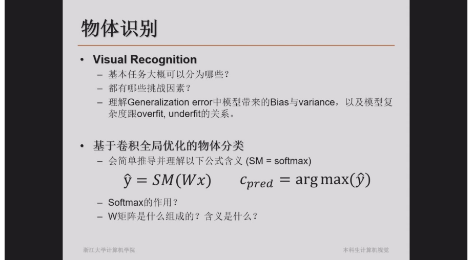

### 第一部分：Visual Recognition (视觉识别)

#### 1. 基本任务大概可以分为哪些？

这是在问视觉识别领域包含了哪些主要的子任务。通常包括：
* **图像分类 (Image Classification)**：判断一张图中主要包含什么物体（例如，猫、狗、汽车）。
* **物体定位 (Object Localization)**：在分类的基础上，还需要用一个边界框（Bounding Box）标出该物体在图中的位置。
* **物体检测 (Object Detection)**：在一张图中找到**所有**感兴趣的物体，并用边界框标出它们各自的位置和类别。这是定位的泛化。
* **语义分割 (Semantic Segmentation)**：将图像中的每个像素点都划分到一个类别中（例如，所有属于“天空”的像素、所有属于“树”的像素）。
* **实例分割 (Instance Segmentation)**：比语义分割更进一步，它需要区分开同一类别的不同实例（例如，标出这是“第一只羊”，那是“第二只羊”）。

#### 2. 都有哪些挑战因素？

这是在问计算机在进行物体识别时，通常会遇到哪些困难。主要挑战包括：

* **视角变化 (Viewpoint Variation)**：同一个物体从不同角度看，形态差异很大。
* **光照变化 (Illumination Variation)**：光照的强弱、方向、颜色会极大地改变图像的像素值。
* **尺度变化 (Scale Variation)**：物体在图像中可大可小。
* **遮挡 (Occlusion)**：物体可能被部分遮挡。
* **形变 (Deformation)**：许多物体（如人和猫）不是刚体，形态可变。
* **背景混杂 (Background Clutter)**：物体的背景非常复杂，容易与物体本身混淆。
* **类内差异 (Intra-class Variation)**：同一类别下的不同实例之间差异可能很大（例如，“椅子”有各种各样的形态）。

#### 3. 理解Generalization error中模型带来的Bias与variance,以及模型复杂度跟overfit, underfit的关系。

这是一个非常核心的机器学习概念，即**泛化误差、偏差-方差、模型复杂度、过拟合与欠拟合**之间的关系。
* **泛化误差 (Generalization Error)**：指模型在**未见过的新数据**上的表现好坏。我们希望这个误差越低越好。它主要由**偏差 (Bias)** 和 **方差 (Variance)** 组成。
* **偏差 (Bias)**：指模型的预测结果与真实值之间的系统性差距。高偏差通常意味着模型**太简单**，没能学到数据的基本规律，导致**欠拟合 (Underfit)**。
* **方差 (Variance)**：指模型对于训练数据中微小变化的敏感程度。高方差通常意味着模型**太复杂**，把训练数据中的噪声也学了进去，导致**过拟合 (Overfit)**，即在训练集上表现很好，但在新数据上表现很差。
* **关系总结**：
    * **模型过于简单** -> 高偏差，低方差 -> **欠拟合**
    * **模型过于复杂** -> 低偏差，高方差 -> **过拟合**
    * 理想的模型是在偏差和方差之间找到一个**平衡点（Trade-off）**，使得总的泛化误差最低。

### 第二部分：基于卷积全局优化的物体分类

这部分聚焦于一个具体的物体分类模型，很可能是指一个卷积神经网络（CNN）的最后分类阶段。

#### 1. 会简单推导并理解以下公式含义 (SM = softmax)

这里给出了一个线性分类器的基本公式。

* **$\hat{y} = \text{SM}(Wx)$**
    * $x$: 输入数据，通常是一个**特征向量**（比如，由CNN的前面几层从图像中提取出来的特征）。
    * $W$: **权重矩阵 (Weight Matrix)**。
    * $Wx$: 这是一个矩阵乘法，它将输入特征 $x$ 线性变换为每个类别的**原始得分（logits）**。
    * $\text{SM}$: **Softmax函数**。
    * $\hat{y}$: 模型的最终输出，是一个**概率分布向量**，向量中的每个值代表输入 $x$ 属于对应类别的概率。
* **$c_{\text{pred}} = \text{argmax}(\hat{y})$**
    * $\text{argmax}$: 一个函数，它返回向量中值最大的那个元素的**索引（index）**。
    * $\hat{y}$: 上一步得到的概率分布向量。
    * $c_{\text{pred}}$: 最终预测的类别。也就是概率最高的那个类别所对应的索引。

#### 2. Softmax的作用？

Softmax函数在这里主要有两个作用：
1.  **归一化**：它能将一个任意实数组成的向量（即原始得分 $Wx$）转换成一个**概率分布**。转换后的向量中，每个元素的值都在$[0,1]$之间，且所有元素之和为1。
2.  **增强差异**：由于其内部使用了指数函数（$e^x$），它会放大得分向量中最大值的影响，使得最终的概率分布更加"尖锐"，让模型对其预测结果更有信心。

#### 3. $W$矩阵是什么组成的？含义是什么？

* **组成**：$W$ 是一个权重矩阵。假设输入特征 $x$ 的维度是 $D$，而总共有 $C$ 个类别，那么 $W$ 矩阵的维度就是 $C \times D$。
* **含义**：我们可以把 $W$ 矩阵的**每一行**看作是对应**一个类别**的**"模板"或"原型"（template/prototype）**。
    * $Wx$ 的计算过程，本质上是分别计算输入特征 $x$ 与**每一个类别模板**的**相似度**（通过点积）。
    * 如果输入特征 $x$ 与第 $i$ 个类别的模板（即 $W$ 的第 $i$ 行）非常匹配，那么点积的结果就会很大，从而使得第 $i$ 类的原始得分很高，最终通过Softmax函数得到的概率也最高。
    * 这个 $W$ 矩阵是在模型训练过程中，通过反向传播算法**学习**得到的。训练的目标就是让 $W$ 中的每个模板能最好地识别出对应类别的特征。

## 深度学习

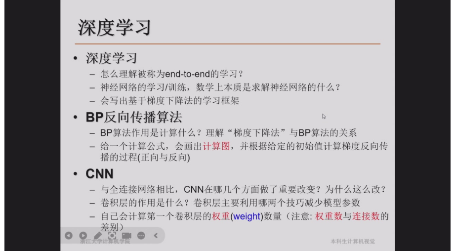

### 深度学习 (Deep Learning)

这部分介绍了深度学习的核心思想和训练方法。

* **怎么理解被称为 end-to-end 的学习？**
    **端到端（End-to-End）学习** 指的是一种直接从原始输入数据（如图像像素）映射到最终输出（如物体类别）的学习模式，中间不需要人为设计和干预特征提取等步骤。整个模型，从输入到输出，是一个统一的、可微分的整体，所有参数被联合优化。
    * **对比传统方法**：传统机器学习流程通常分为两步：1. 手动设计特征提取器（如 SIFT, HOG）；2. 将提取的特征送入一个独立的分类器（如 SVM）。而端到端学习则让神经网络**自动学习**如何提取最有用的特征。

* **神经网络的学习/训练，数学上本质是求解神经网络的什么？**
    数学上的本质是**优化问题（Optimization）**。具体来说，是寻找一套能使**损失函数（Loss Function）**最小化的神经网络**参数（Parameters）**，即**权重 `W` 和偏置 `b`**。损失函数用于衡量模型预测值与真实标签之间的差距。因此，训练过程就是一个大规模的数值优化过程。

* **会写出基于梯度下降法的学习框架**
    这是一个基本的训练循环框架：
    1.  **初始化**：随机初始化网络的所有参数（权重和偏置）。
    2.  **循环迭代**：
        a.  **前向传播 (Forward Pass)**：将一批训练数据输入网络，计算得到预测输出。
        b.  **计算损失 (Compute Loss)**：根据预测输出和真实标签，计算损失值。
        c.  **反向传播 (Backward Pass)**：计算损失函数关于网络中每一个参数的梯度（gradient）。
        d.  **更新参数 (Update Parameters)**：沿着梯度的反方向，对参数进行一小步的更新，以减小损失值。公式为：`参数 = 参数 - 学习率 × 梯度`。

### BP 反向传播算法 (Backpropagation)

这部分聚焦于训练神经网络的核心引擎——BP算法。

* **BP 算法作用是计算什么？理解“梯度下降法”与 BP 算法的关系**
    * **BP 算法的作用**：BP 算法本身**不是**优化算法，它是一种高效**计算梯度**的算法。它利用微积分中的**链式法则（Chain Rule）**，将损失从输出层开始，逐层向后传播，从而计算出损失函数对网络中所有参数的精确梯度。
    * **关系**：它们是**合作伙伴**关系。**梯度下降法**是优化器，它**使用**梯度来更新参数；而**BP 算法**是计算引擎，它为梯度下降法**提供**所需要的梯度。简单说：BP 负责“算方向”，梯度下降法负责“迈步子”。

* **给一个计算公式，会画出计算图，并根据给定的初始值计算梯度反向传播的过程（正向与反向）**
    这是一项实践技能，流程如下：
    1.  **画计算图 (Computation Graph)**：将复杂的公式分解为一系列基本运算（加、乘、激活函数等），每个变量和运算都是图中的一个节点。
    2.  **正向传播**：从输入节点开始，根据给定的初始值，沿着图的方向一步步计算，直到得到最终的输出值（损失值）。
    3.  **反向传播**：从最终的输出节点开始（其梯度为1），利用链式法则，反向依次计算出每个节点的梯度。例如，若 $z = f(x, y)$，则 $\frac{\partial Loss}{\partial x} = \frac{\partial Loss}{\partial z} \cdot \frac{\partial z}{\partial x}$。这样逐层向后，最终得到损失对所有输入参数的梯度。

### CNN (卷积神经网络)

* **与全连接网络相比，CNN在哪几个方面做了重要改变？为什么这么改？**
    * **重要改变**：
        1.  **局部连接 (Local Connectivity)**：神经元不再连接到前一层的所有神经元，而只连接到一个局部的感受野（receptive field）。
        2.  **参数共享 (Parameter Sharing)**：同一个卷积核（filter）在整张输入图像上滑动，用同一组权重处理不同位置的数据。
    * **为什么这么改（动机）**：这些改变是为了有效利用图像的内在属性。
        1.  **利用空间局部性**：图像中的像素，通常只和它周围的像素关系最密切。局部连接正是利用了这一特性。
        2.  **实现平移不变性并提升效率**：参数共享使得网络能够在图像的不同位置检测到同一种特征（如一条边或一个角），这叫作平移不变性。同时，它使得需要学习的参数数量**急剧减少**，大大降低了模型过拟合的风险，也使得训练深层网络成为可能。

* **卷积层的作用是什么？卷积层主要利用哪个两个技巧减少模型参数**
    * **作用**：卷积层的主要作用是**特征提取 (Feature Extraction)**。每一组卷积核都被训练来识别一种特定的视觉模式，从低级的边缘、颜色、纹理，到高级的物体部件。
    * **两个技巧**：正是上面提到的 **局部连接** 和 **参数共享**。

* **自己会计算第一个卷积层的权重 (weight) 数量 (注意: 权重数与连接数的差别)**
    * **权重数量计算**：假设输入图像有 $C_{in}$ 个通道（如RGB图像是3），卷积层有 $K$ 个卷积核（也决定了输出通道数 $C_{out} = K$），每个卷积核的大小是 $F \times F$。
        * 一个卷积核的权重数量 = $F \times F \times C_{in}$ （因为卷积核必须和输入通道数有相同的深度）。
        * 该层总的**权重数量** = $K \times (F \times F \times C_{in})$。
        * 此外，每个卷积核通常还带有一个偏置（bias）参数，所以总的**可学习参数数量** = $(K \times F \times F \times C_{in}) + K$。
    * **与连接数的差别**：**连接数**是一个庞大得多的概念。如果没有参数共享，输出特征图上的每个像素点都由一个独立的卷积核算出，这将导致参数量爆炸。参数共享让所有这些连接**共享**同一小组权重，从而极大地减少了参数数量。
    * **连接数计算**：
        * 假设输入特征图大小为 $H \times W \times C_{in}$，卷积核大小为 $F \times F$，步长为 $S$，输出特征图大小为 $H_{out} \times W_{out} \times C_{out}$。
        * 对于输出特征图的每个位置：
            * 需要 $F \times F \times C_{in}$ 个连接（因为每个输出点都要和感受野内的所有输入点建立连接）
        * 总连接数 = $H_{out} \times W_{out} \times C_{out} \times (F \times F \times C_{in})$
        * 这个数字通常远大于权重数，因为同一组权重被重复使用在不同位置。
        * 例如：对于一个 $224 \times 224 \times 3$ 的输入图像，使用 64 个 $3 \times 3$ 的卷积核，步长为 1：
            * 权重数 = $64 \times (3 \times 3 \times 3) + 64 = 1,792$
            * 连接数 = $222 \times 222 \times 64 \times (3 \times 3 \times 3) \approx 87.8$ 百万

### 关于训练 (About Training)

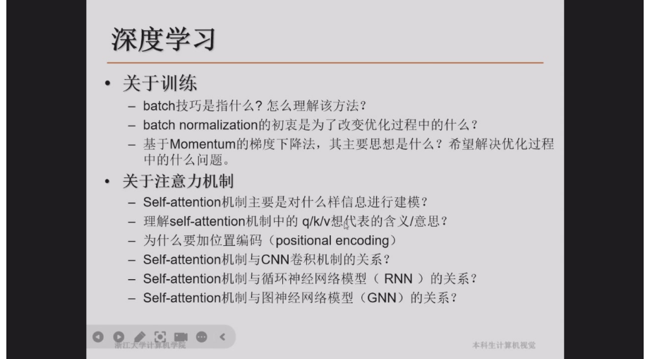

这部分主要讨论在训练深度学习模型时常用的一些关键技术。

* **batch技巧是指什么？怎么理解该方法？**
    * **Batch技巧**：通常指的是**小批量梯度下降（Mini-batch Gradient Descent）**。在训练时，我们不一次性将整个数据集（Full-batch）或一次只将一个样本（Stochastic Gradient Descent, SGD）喂给模型，而是将数据集切分成若干个大小相等的小块，即“批次”（batch）。每次迭代时，只用一个批次的数据来计算损失、更新模型参数。
    * **如何理解**：这是一种在计算效率和梯度稳定性之间的**折中方案**。
        * **相比整个数据集**：计算更快，内存占用更小，并且梯度的随机性有助于模型跳出局部最小值。
        * **相比单个样本**：梯度估计更稳定、噪声更小，并且可以充分利用GPU等硬件的并行计算能力，训练效率更高。

* **batch normalization的初衷是为了改变优化过程中的什么？**
    * **Batch Normalization (BN) 的初衷**是为了解决**内部协变量偏移（Internal Covariate Shift, ICS）**问题。
    * **ICS 是指**：在训练过程中，由于前一层网络参数的不断变化，导致后一层网络接收到的输入数据的分布也在不断变化。这使得后一层的网络需要不断去适应新的数据分布，增加了训练难度。
    * **BN 的做法**：通过在网络层之间对每个批次的数据进行归一化（使其均值为0，方差为1），并引入可学习的缩放和平移参数，来强制稳定每一层输入的分布。这极大地**加速了模型收敛，允许使用更高的学习率，并起到了一定的正则化效果**。

* **基于Momentum的梯度下降法，其主要思想是什么？希望解决优化过程中的什么问题。**
    * **主要思想**：引入物理学中**“动量”（Momentum）**的概念，为梯度下降增加“惯性”。参数的更新方向不仅仅取决于当前位置的梯度，还取决于**历史梯度的累积**。它维持一个“速度”向量，这个向量是过去梯度的指数移动平均。
    * **希望解决的问题**：
        1.  **抑制震荡**：在标准的梯度下降中，当损失函数的形状像一个狭长的山谷时，更新方向会在山谷两侧来回震荡。动量可以平均掉这些震荡，使得更新方向更稳定地指向谷底。
        2.  **加速收敛**：在梯度方向基本一致的区域，动量会不断累积，使得“速度”越来越快，从而能够更快地到达最小值点，也有助于“冲过”一些微小的局部极小值点。

### 关于注意力机制 (About Attention Mechanism)

* **Self-attention机制主要是要对什么样信息进行建模？**
    * Self-attention（自注意力）机制主要是为了建模**单个样本内部不同元素之间的依赖关系**。它允许模型在处理一个元素时，去衡量序列中所有其他元素对当前元素的重要性，并根据这个重要性（权重）来聚合信息。简而言之，它建模的是**“内部关系”**。

* **理解self-attention机制中的q/k/v想代表的含义/意思？**
    * 这是自注意力机制从信息检索领域借鉴来的核心概念：**Query（查询）、Key（键）、Value（值）**。
    * **Query (Q)**：代表当前正在处理的元素。它发起的“查询”可以理解为：“我应该关注序列里的哪些信息？”
    * **Key (K)**：代表序列中所有可被查询的元素。它像一个“标签”，用来和Q进行匹配，以计算相关性。
    * **Value (V)**：代表序列中所有元素的实际内容或特征。
    * **工作流程**：通过计算一个Q和所有K的相似度（通常是点积），得到**注意力分数**。然后将这些分数通过Softmax进行归一化，得到**注意力权重**。最后，用这些权重对所有的V进行**加权求和**，得到的结果就是当前Q位置的输出，这个输出融合了整个序列中与Q最相关的信息。

* **为什么要去位置编码 (positional encoding)**（幻灯片中“加”应为“加”）
    * **原因**：基础的自注意力机制是**置换不变的**，它本身**无法感知序列中元素的顺序信息**。它像一个“词袋模型”，打乱输入元素的顺序，计算结果也基本不变。但在很多任务（如自然语言处理）中，顺序是至关重要的。
    * **解决方法**：**位置编码**就是向输入数据中注入位置信息。它是一个与输入特征维度相同的向量，这个向量的模式能够表示一个元素在序列中的绝对或相对位置。将位置编码向量与元素的特征向量相加，就使得模型能够区分开出现在不同位置的相同元素。

* **Self-attention机制与CNN卷积机制的关系？**
    * **CNN**：卷积可以看作是一种**局部的、静态的注意力**。它的感受野是局部的，并且卷积核的权重是固定的（参数共享），与输入数据无关。
    * **Self-attention**：可以看作是一种**全局的、动态的注意力**。它可以直接建立序列中任意两个元素之间的联系，无论它们相距多远。并且，注意力权重是根据输入数据动态计算出来的。
    * **关系**：可以说，卷积是一种受限的、特殊的自注意力。

* **Self-attention机制与循环神经网络模型 (RNN) 的关系？**
    * **RNN**：**顺序处理**序列，通过一个隐藏状态来传递历史信息。这种串行处理模式使其难以并行化，且在处理长序列时容易出现梯度消失/爆炸问题，难以捕捉长期依赖。
    * **Self-attention**：**并行处理**整个序列，任意两个元素之间的信息传递路径长度都是1，因此非常擅长捕捉长期依赖。
    * **关系**：两者都是为处理序列数据而设计的，但机制完全不同。目前，以自注意力为核心的Transformer模型在许多序列任务上已经很大程度上取代了RNN。

* **Self-attention机制与图神经网络模型 (GNN) 的关系？**
    * **GNN**：在图结构数据上运行，通过“消息传递”机制，让每个节点聚合其邻居节点的信息。
    * **Self-attention**：可以被看作是**一种在全连接图上运行的GNN**。在自注意力中，序列里的每个元素都是一个节点，并且每个节点都与其他所有节点相连。注意力权重就相当于图中动态计算出来的边的权重。
    * **关系**：GNN的概念更广。图注意力网络（Graph Attention Network, GAT）就是将自注意力的思想应用到任意稀疏图结构上的一种GNN。

## 相机模型

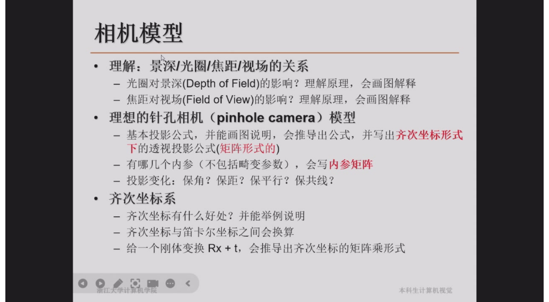

### 理解：景深/光圈/焦距/视场的关系

这部分探讨了摄影学中的四个核心概念及其相互关系。

* **光圈对景深(Depth of Field)的影响？理解原理，会画图解释**
    * **影响**：**光圈越小（f值越大，如f/16），景深越大**（清晰范围更广）；**光圈越大（f值越小，如f/1.8），景深越浅**（背景虚化更明显）。
    * **原理**：景深是指在焦点前后，能被相机清晰成像的距离范围。其物理原理基于**弥散圆（Circle of Confusion）**。当一个物点没有精确地对焦在感光元件上时，它会形成一个模糊的光斑（弥散圆）。
        * 当**光圈开大**时，光线进入相机的角度更分散，导致焦外的点形成的弥散圆更大，人眼更容易察觉到模糊。
        * 当**光圈缩-**时，光线进入的角度更集中，焦外的点形成的弥散圆也更小。在弥散圆小到人眼无法分辨的范围内，我们都认为影像是清晰的，因此清晰的范围（景深）就变大了。
    * **画图解释**：应画出两种情况：大光圈和小光圈下，一个焦外的点发出的光线经过镜头后，在感光元件上形成大小不同的弥散圆。

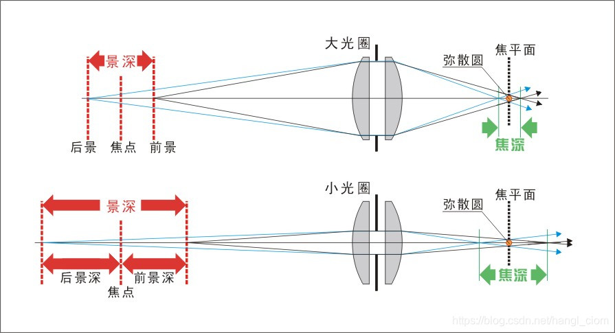

* **焦距对视场(Field of View)的影响？理解原理，会画图解释**
    * **影响**：**焦距越短（如24mm广角镜头），视场越宽**；**焦距越长（如200mm长焦镜头），视场越窄**。
    * **原理**：视场（也称视角）是指相机能够“看到”的场景范围。它由**焦距 `f`** 和**感光元件尺寸 `s`** 共同决定。在感光元件尺寸固定的情况下，焦距 `f` 决定了主点到感光元件边缘的张角。
        * **短焦距**时，同样的感光元件尺寸对应的张角更大，能容纳的景物范围就更广。
        * **长焦距**时，张角变小，相当于对远处的景物进行了“放大”，只能看到更小范围的景物。
    * **画图解释**：应画出感光元件尺寸固定，在两个不同焦距（一个长一个短）的镜头下，所能捕捉到的场景角度范围的示意图。
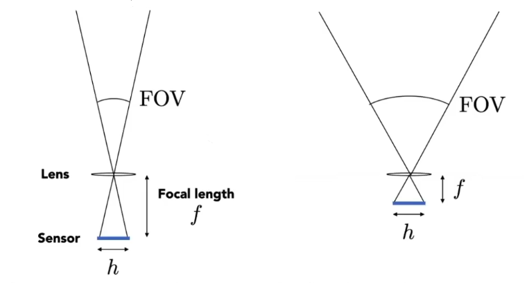

### 理想的针孔相机 (pinhole camera) 模型

这是计算机视觉中最基础、最重要的相机数学模型。

* **基本投影公式，并能画图说明，会推导出公式，并写出齐次坐标形式下的透视投影公式(矩阵形式的)**
    * **画图与推导**：通过**相似三角形原理**进行推导。设相机坐标系中有一个三维点 `P = (X, Y, Z)`，相机中心（针孔）在原点，像平面位于 `z=f` 处（`f`为焦距）。从侧面看，根据相似三角形，其在像平面上的投影点 `p = (x, y)` 满足：
        $$\frac{x}{f} = \frac{X}{Z} \implies x = f \frac{X}{Z}$$
        $$\frac{y}{f} = \frac{Y}{Z} \implies y = f \frac{Y}{Z}$$
    * **齐次坐标下的矩阵形式**：为了用线性代数统一表示，我们引入齐次坐标。三维点 `P` 的齐次坐标为 `[X, Y, Z, 1]^T`。投影过程可以表示为：
        $$
        \begin{bmatrix} x' \\ y' \\ w' \end{bmatrix} =
        \begin{bmatrix} f & 0 & 0 & 0 \\ 0 & f & 0 & 0 \\ 0 & 0 & 1 & 0 \end{bmatrix}
        \begin{bmatrix} X \\ Y \\ Z \\ 1 \end{bmatrix}
        = \begin{bmatrix} fX \\ fY \\ Z \end{bmatrix}
        $$
        其中 `(x', y', w')` 是像点在齐次坐标下的表示。要转换回笛卡尔坐标，只需 `x = x'/w'` 和 `y = y'/w'`，即 `x = fX/Z`，`y = fY/Z`，与之前推导一致。

* **有哪几个内参(不包括畸变参数)，会写内参矩阵**
    * **内参 (Intrinsics)**：描述相机自身特性的参数，共5个：
        * `f_x`, `f_y`：分别是在x和y方向上，以像素为单位度量的焦距。
        * `c_x`, `c_y`：主点（principal point）坐标，即相机光轴与像平面的交点，通常在图像中心附近。
        * `s`：坐标轴倾斜参数（skew），现代相机通常为0。
    * **内参矩阵 (Intrinsic Matrix `K`)**：
        $$
        K = \begin{bmatrix} f_x & s & c_x \\ 0 & f_y & c_y \\ 0 & 0 & 1 \end{bmatrix}
        $$

* **投影变化: 保角？保距？保平行？保共线？**
    * **保角 (Conformal)**：不保持。
    * **保距 (Isometry)**：不保持（远小近大）。
    * **保平行 (Parallelism)**：不保持（现实中平行的铁轨在照片中会汇交于远处的灭点）。
    * **保共线 (Collinearity)**：**保持**。三维空间中的一条直线，投影到图像上仍然是一条直线。

### 齐次坐标系 (Homogeneous Coordinate System)

* **齐次坐标有什么好处？并能举例说明**
    * **好处1：统一变换形式**。它能将几何变换（如旋转、缩放）和位移（平移）用**同一种形式——矩阵乘法**来表示，极大地简化了计算。
        * **举例**：如果没有齐次坐标，一个点的刚体变换是 $X' = RX + t$，既有乘法又有加法。在齐次坐标下，可以统一成 $X'_h = T X_h$ 的一次矩阵乘法。
    * **好处2：表示无穷远点**。它能很自然地表示射影几何中的无穷远点（如灭点），其齐次坐标的最后一个分量为0。

* **齐次坐标与笛卡尔坐标之间会换算**
    * **笛卡尔 → 齐次**：$n$维笛卡尔坐标 $(x_1, ..., x_n)$ 变为 $(n+1)$维齐次坐标 $(x_1, ..., x_n, 1)$。
    * **齐次 → 笛卡尔**：$(n+1)$维齐次坐标 $(x_1, ..., x_n, w)$ 变为 $n$维笛卡尔坐标 $(\frac{x_1}{w}, ..., \frac{x_n}{w})$。（当 $w=0$ 时代表无穷远点）。

* **给一个刚体变换 Rx+t, 会推导出齐次坐标的矩阵乘形式**
    * **刚体变换**：一个三维点 $X$ 经过旋转 $R$ (3×3矩阵) 和平移 $t$ (3×1向量) 得到新点 $X' = RX + t$。
    * **推导**：将 $X$ 和 $X'$ 写成齐次坐标 $X_h = \begin{bmatrix} X \\ 1 \end{bmatrix}$ 和 $X'_h = \begin{bmatrix} X' \\ 1 \end{bmatrix}$。我们想找到一个4×4的变换矩阵 $T$，使得 $X'_h = T X_h$。
$$
X'_h = \begin{bmatrix} X' \\ 1 \end{bmatrix} = \begin{bmatrix} RX + t \\ 1 \end{bmatrix}
$$
我们可以构建 $T$ 如下：
$$
T = \begin{bmatrix} R & t \\ \mathbf{0} & 1 \end{bmatrix}
$$
其中 $R$ 是3×3旋转矩阵，$t$ 是3×1平移向量，$\mathbf{0}$ 是1×3的零向量。验证一下：
$$
T X_h = \begin{bmatrix} R & t \\ \mathbf{0} & 1 \end{bmatrix} \begin{bmatrix} X \\ 1 \end{bmatrix} = \begin{bmatrix} RX + t \cdot 1 \\ \mathbf{0}X + 1 \cdot 1 \end{bmatrix} = \begin{bmatrix} RX + t \\ 1 \end{bmatrix} = X'_h
$$
推导完成。这个 $T$ 就是外参矩阵。

### 畸变 (Distortion)

理想的针孔模型假设光线沿直线传播，但真实世界中的镜头是凸透镜，会使光线弯曲，从而产生畸变。

* **径向畸变与切向畸变各是什么原因引起的？**
    * **径向畸变 (Radial Distortion)**：主要由**镜头的形状**引起。由于透镜的曲率，光线在远离透镜中心的地方比在中心地方的弯曲程度更大。这导致图像中的直线会向外（桶形）或向内（枕形）弯曲。
    * **切向畸变 (Tangential Distortion)**：主要由**镜头与相机感光元件平面不完全平行**引起。这种安装上的微小偏差会导致图像在某个方向上被拉伸，看起来像是倾斜的。

* **径向畸变常见的有哪两种？**
    1.  **桶形畸变 (Barrel Distortion)**：图像的边缘向外凸出，像一个木桶的侧面。这在**广角镜头**中非常常见。
    2.  **枕形畸变 (Pincushion Distortion)**：图像的边缘向内凹陷，像一个枕头的侧面。这在**长焦镜头**中比较常见。

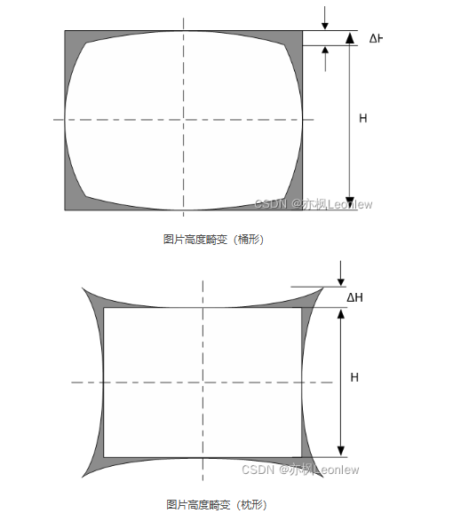

### 相机外参 (Camera Extrinsics)

外参描述的是相机在世界中的"身份"——它的位置和朝向。

* **外参有哪几个？分别代表什么含义？齐次坐标下的外参矩阵会写、会推导。**
    * **参数数量与含义**：外参共有**6个自由度**，它们定义了**世界坐标系**到**相机坐标系**的变换。
        1.  **旋转 (Rotation)**：3个参数，描述相机的**朝向**。可以用一个3×3的旋转矩阵 $R$ 来表示。
        2.  **平移 (Translation)**：3个参数，描述相机光心在世界坐标系中的**位置**。可以用一个3×1的平移向量 $t$ 来表示。
    * **外参矩阵（齐次坐标）**：外参的作用是将一个在世界坐标系下的点 $P_w$ 转换到相机坐标系下的点 $P_c$，即 $P_c = R \cdot P_w + t$。为了用一次矩阵乘法完成这个变换，我们使用齐次坐标。外参矩阵 $T$ 是一个4×4的矩阵：
        $$
        T = \begin{bmatrix} R & t \\ \mathbf{0} & 1 \end{bmatrix}
        $$
        其中 $R$ 是3×3旋转矩阵，$t$ 是3×1平移向量，$\mathbf{0}$ 是一个1×3的零向量。这个矩阵可以将世界坐标系下的齐次坐标点 $[P_w; 1]$ 转换为相机坐标系下的齐次坐标点 $[P_c; 1]$。

---

### 四个坐标系 (The Four Coordinate Systems)

从真实世界的一个点到它在最终数字图像上的像素位置，需要经过一系列坐标系的变换。

* **知道相机模型成像过程中涉及的四个坐标系**
    1.  **世界坐标系 (World Coordinate System)**：用户自定义的一个固定的三维坐标系，用来描述场景中物体的位置。单位通常是米(m)。
    2.  **相机坐标系 (Camera Coordinate System)**：以相机光心为原点，Z轴沿光轴方向（镜头朝向）的三维坐标系。单位也是米(m)。
    3.  **图像物理坐标系 (Image Plane Coordinate System)**：在相机感光元件（CCD或CMOS）上的一个二维坐标系，原点是主点（光轴与像平面的交点）。单位是毫米(mm)。
    4.  **像素坐标系 (Pixel Coordinate System)**：最终我们得到的数字图像所使用的二维坐标系，原点通常在图像的**左上角**。单位是像素(pixel)。

* **会画图展示内参、外参、畸变参数在成像各阶段中的角色（从真实的世界坐标到图像坐标的过程）**

这个过程是整个相机模型的核心，它将所有参数串联了起来：

1.  **世界坐标系 → 相机坐标系**
    * **作用参数**：**外参 $[R|t]$**
    * **过程**：通过旋转 $R$ 和平移 $t$，将世界中的一个点 $P_w$ 的坐标转换到以相机为中心的坐标系下，得到 $P_c$。
    $$P_c = R \cdot P_w + t$$

2.  **相机坐标系 → 理想图像物理坐标系 (无畸变)**
    * **作用参数**：**内参中的焦距 $f_x, f_y$**
    * **过程**：通过透视投影（针孔模型），将三维点 $P_c$ 投影到二维的图像平面上，得到理想的、无畸变的坐标 $p_{undistorted}$。
    $$x_{undistorted} = f_x \frac{X_c}{Z_c}, \quad y_{undistorted} = f_y \frac{Y_c}{Z_c}$$

3.  **理想图像物理坐标系 → 实际图像物理坐标系 (有畸变)**
    * **作用参数**：**畸变参数 $k_1, k_2, p_1, p_2, ...$**
    * **过程**：将理想的坐标点 $p_{undistorted}$ 根据畸变模型（包括径向和切向畸变）进行计算，得到真实镜头下、带有畸变的坐标 $p_{distorted}$。

4.  **实际图像物理坐标系 → 像素坐标系**
    * **作用参数**：**内参中的主点 $c_x, c_y$ 以及像素/毫米转换关系**
    * **过程**：将带有畸变的、以主点为原点的物理坐标 $p_{distorted}$，进行单位转换和原点平移，最终得到以左上角为原点的像素坐标 $(u, v)$。

**总结**：**外参**负责将物体从世界"搬到"相机面前；**内参**负责将相机面前的物体"投影"到像平面上并完成数字化；**畸变参数**则负责修正这个投影过程中由镜头不完美所带来的变形。

从世界坐标系到像素坐标系

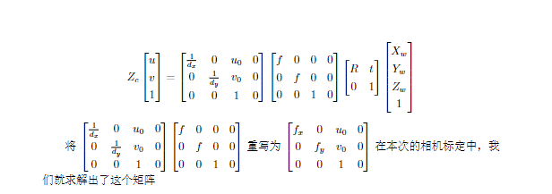

## 相机定标

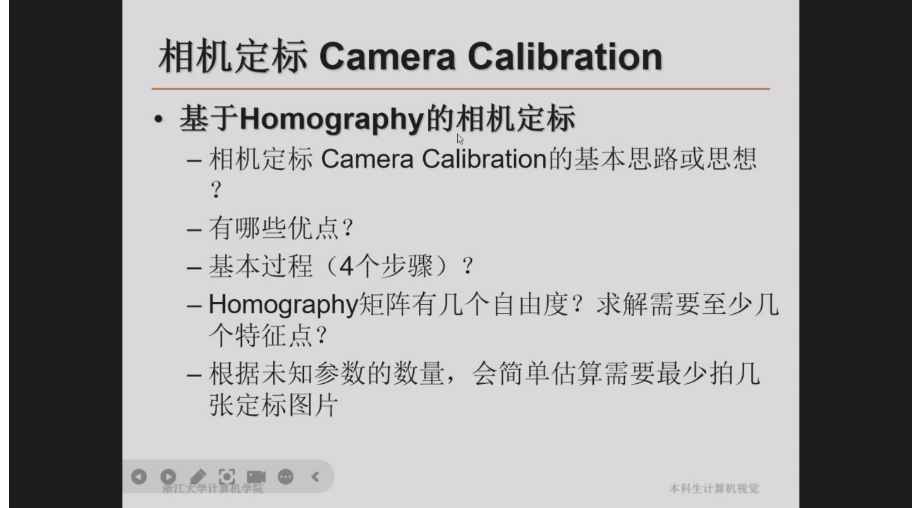

### 基于Homography的相机定标

* **相机定标 Camera Calibration 的基本思路或思想？**
    相机定标的**基本思想**是，通过观测一个我们**尺寸已知的参照物**（例如棋盘格），来反推出相机的**内部和外部参数**。因为我们知道参照物上特征点在三维空间中的精确位置，也知道这些点在拍摄的二维图像上的像素位置，我们就可以建立一组方程来求解描述这个三维到二维映射过程的未知参数（如焦距、主点、畸变系数等）。

* **有哪些优点？**
    这种基于平面棋盘格的定标方法（张氏标定法）相较于传统方法，主要有以下**优点**：
    * **简单灵活**：只需要一个打印的棋盘格平面，制作简单，操作方便，无需昂贵复杂的三维标定物。
    * **精度高**：虽然设备简单，但该方法可以达到非常高的标定精度。
    * **无需特殊设备**：不需要知道相机的精确运动，用户只需手持平面标定板在相机前摆出几个不同的姿态即可。

* **基本过程（4个步骤）？**
    1.  **准备标定板并拍摄图像**：打印一张棋盘格标定板，并从不同角度、不同位置拍摄 **10-20** 张该标定板的清晰图像。
    2.  **提取特征点**：在每一张拍摄的图像中，使用图像处理算法精确地检测出所有棋盘格角点的**像素坐标** `(u, v)`。由于我们知道棋盘格每个格子的大小，因此我们也知道这些角点在标定板这个平面上的**物理坐标** `(X, Y, 0)`。
    3.  **计算单应性矩阵 (Homography)**：对于每一张图像，根据其2D像素坐标和对应的3D物理坐标，计算出一个**单应性矩阵 `H`**，它描述了标定板平面到图像平面的投影关系。
    4.  **求解相机参数**：利用所有图像计算出的多个单应性矩阵，建立约束方程组，从而求解出相机的**内参矩阵 `K` 和畸变系数**。一旦内参求出，每张图像对应的**外参（旋转 `R` 和平移 `t`）**也可以随之解出。通常最后会有一个非线性优化步骤（如L-M算法）来提炼所有参数，以获得更精确的结果。

* **Homography矩阵有几个自由度？求解需要至少几个特征点？**
    * **自由度 (DOF)**：一个单应性矩阵是一个3x3的矩阵，但它定义在一个尺度因子上（即乘以任意非零常数后，矩阵作用不变）。因此，它的9个元素中只有8个是独立的，所以它有 **8 个自由度**。
    * **最少特征点**：每一对匹配的特征点（一个2D点对应一个3D点）可以提供2个约束方程（x和y）。为了求解8个未知数，我们至少需要 `8 / 2 = 4` 对特征点。因此，求解单应性矩阵至少需要 **4 对**不共线的特征点。

* **根据未知参数的数量，会简单估算需要最少拍几张标定图片**
    * **未知参数**：我们主要想求解的是相机的内参。一个简化的内参矩阵包含 `f_x`, `f_y`, `c_x`, `c_y` 四个参数。
    * **约束条件**：每一张标定图片（即每一个单应性矩阵 `H`）可以为内参提供 **2 个**约束方程。
    * **最少图片数**：为了求解4个或更多的未知内参，理论上我们至少需要 `4 / 2 = 2` 张图片。然而，为了得到一个稳定且唯一的解，通常需要至少 **3 张**不同姿态的标定图片。在实际操作中，使用更多的图片（如10-20张）会使结果更鲁棒、更精确。

## 立体视觉

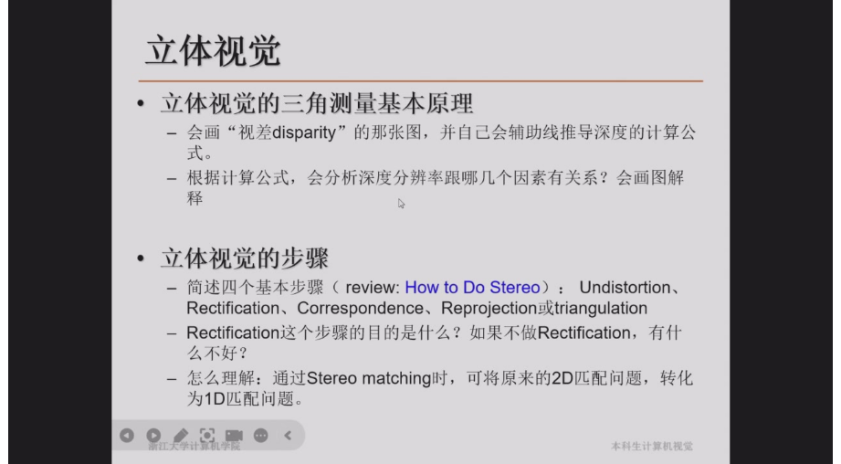

### 立体视觉的三角测量基本原理

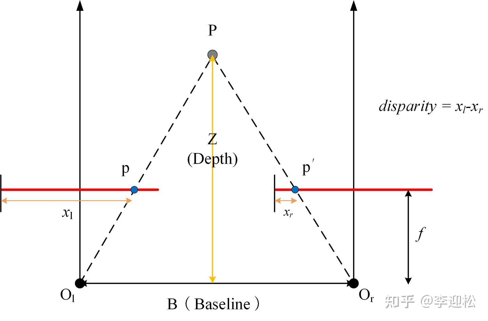
* **会画"视差disparity"的那张图，并自己会辅助推导深度的计算公式。**
    * **核心图示**：这是一个经典的理想化双目相机模型图。它通常包含：
        * 两个光心平行的相机，左相机光心 $O_L$ 和右相机光心 $O_R$。
        * 两个相机之间的距离，称为**基线（Baseline）$B$**。
        * 两个相机具有相同的**焦距（focal length）$f$**。
        * 空间中的一个三维点 $P$，其深度为 $Z$。
        * $P$ 在左右两个像平面上的投影点 $p_L$ 和 $p_R$，其坐标分别为 $x_L$ 和 $x_R$。
    * **公式推导**：基于**相似三角形原理**。
        * 观察左相机，有相似三角形关系：$x_L / f = X / Z$。
        * 观察右相机，有相似三角形关系：$x_R / f = (X - B) / Z$。
        * **视差（Disparity）$d$** 被定义为同一个空间点在左右两张图像上投影位置的差异：$d = x_L - x_R$。
        * 将上面两个关系式代入视差定义中：
            $d = (f \cdot X / Z) - (f \cdot (X - B) / Z) = (fX - fX + fB) / Z = fB / Z$
        * 整理后得到最终的**深度计算公式**：
            $$Z = \frac{f \cdot B}{d}$$
    * **结论**：从公式可以看出，**深度 $Z$ 与视差 $d$ 成反比**。视差越大，物体离相机越近；视差越小（趋近于0），物体离相机越远（趋近于无穷远）。

* **根据计算公式，会分析深度分辨率跟哪几个因素有关系？会画图解释**
    * **深度分辨率**：指系统能够区分的最小深度变化。它衡量了深度测量的精度。
    * **分析**：从公式 $Z = fB/d$ 可以看出，深度 $Z$ 是视差 $d$ 的非线性函数。当物体越来越远时，$Z$ 变得很大，$d$ 变得很小。即使 $d$ 变化一个最小单位（例如1个像素），$Z$ 的变化也会非常剧烈。深度测量的误差 $\Delta Z$ 与深度的平方 $Z^2$ 成正比，与基线 $B$ 和焦距 $f$ 成反比： $\Delta Z \propto Z^2 / (fB)$。
    * **影响因素**：
        1.  **深度 $Z$ (最重要的因素)**：深度分辨率随着距离的增加而**急剧下降**。对于远处的物体，深度测量非常不精确。
        2.  **基线 $B$**：基线越大，深度分辨率**越高**（越精确）。
        3.  **焦距 $f$**：焦距越长，深度分辨率**越高**（越精确）。

### 立体视觉的步骤

这部分概述了从两张原始图片计算出深度图的完整流程。

* **简述四个基本步骤 (review: How to Do Stereo) : Undistortion、Rectification、Correspondence、Reprojection或triangulation**
    1.  **去畸变 (Undistortion)**：利用相机标定得到的畸变参数，对左右两张原始图像进行校正，消除由镜头不完美造成的图像扭曲。
    2.  **立体校正 (Rectification)**：对两张图像进行一次投影变换，使得它们的成像平面完全平行，并且每个像素的行（row）都对齐在同一条水平线上（即极线是水平的）。
    3.  **对应点搜索/立体匹配 (Correspondence/Stereo Matching)**：这是最核心也是最困难的一步。为左图中的每一个像素，在右图中寻找与之对应的同一个点。**由于经过了立体校正，这个搜索过程从一个二维问题简化成了一个一维问题**（只需在同一行上搜索）。计算出的左右图像对应点之间的水平像素差，就是**视差 `d`**。这一步的输出是一张**视差图 (Disparity Map)**。
    4.  **重投影/三角化 (Reprojection/Triangulation)**：利用上一步得到的视差图，根据深度计算公式 `Z = fB/d`，为每个像素计算出其在三维空间中的深度值 `Z`。这一步的输出就是我们最终想要的**深度图 (Depth Map)**。

* **Rectification这个步骤的目的是什么？如果不错Rectification，有什么不好？**
    * **目的**：其核心目的就是**极大简化立体匹配的难度**。它通过图像变换，使得原本倾斜的极线变成水平的。
    * **不做的坏处**：如果没有经过立体校正，那么对于左图中的一个点，它在右图中的对应点可能位于一条**任意倾斜的直线（极线）**上。算法需要在二维空间中沿着这条斜线进行搜索，这不仅计算量巨大，而且非常容易出错。**校正后，搜索范围被约束在同一条水平线上**，计算量大大减小，匹配的可靠性也大大提高。

* **怎么理解：通过Stereo matching时，可将原来的2D匹配问题，转化为1D匹配问题。**
    * 这个理解完全正确，并且是**立体校正 (Rectification)** 这一步所带来的直接好处。
    * 根据**极线约束 (Epipolar Constraint)**，一个点在某张视图中的对应点，必然位于另一张视图的一条特定直线上（即极线）。
    * **立体校正**这个操作，就是通过数学变换，巧妙地将所有视图的极线都变成了**与图像扫描线平行的水平线**。
    * 因此，当要为左图 `(u, v)` 位置的像素找匹配点时，我们无需在右图进行全局的二维搜索，而只需在右图的**第 `v` 行**这条直线上进行一维搜索即可。这就是从2D问题到1D问题的转化。

### 结构光三维成像

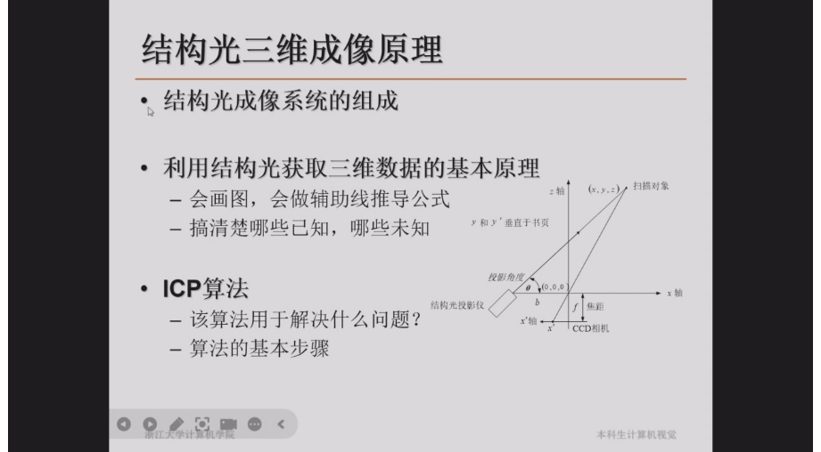

### 结构光成像系统的组成

一个基本的结构光系统通常由以下几个部分组成：
* **相机 (Camera)**：用于拍摄被结构光照射的物体。
* **结构光投影仪 (Projector)**：这是核心部件，负责向物体表面投射一个**已知**的光学图案，例如光条、光栅、格雷码或伪随机散斑。
* **被测物体 (Object)**：我们想要获取其三维形状的物体。
* **计算单元 (Computation Unit)**：通常是一台计算机，用于控制相机和投影仪的同步，并处理拍摄到的图像，最终计算出三维点云数据。

相机和投影仪的位置是固定的，它们之间的相对位姿关系（基线、旋转等）需要**事先精确标定**。

### 利用结构光获取三维数据的基本原理

这部分讲解了结构光技术的核心——**主动三角测量法 (Active Triangulation)**。

* **会画图，会做辅助线推导公式**
    * **基本原理**：与被动双目视觉不同，被动视觉需要通过复杂的“立体匹配”算法在两张图里**寻找**对应点。而结构光是**主动创造**对应点。投影仪投射出的每一条光线都可以被看作是来自一个“虚拟的左相机”。当真实相机（右相机）在图像中看到被投射的光斑或光条时，它就精确地知道这个光斑是由投影仪的哪一条特定光线照射产生的。
    * **推导思路**：如幻灯片中的图所示，我们可以建立一个坐标系（通常以相机光心为原点）。
        1.  **相机侧**：根据相机成像的相似三角形原理，我们可以得到一个方程。相机在图像中观测到的点的坐标 `x'` 与该点的三维坐标 `(x, z)` 之间存在关系：`x' / f = x / z`。
        2.  **投影仪侧**：因为我们精确地知道投影仪投射出的每一条光线的方向（例如，图中的“投影角度” `θ`），我们可以根据投影仪的位置（与相机的距离，即基线 `b`）和光线的方向，建立另一个关于 `x` 和 `z` 的方程。
        3.  **联立求解**：通过联立这两个方程，我们就可以解出唯一的未知数 `z`（深度），进而求出 `x` 和 `y`。

* **搞清楚哪些已知，哪些未知**
    * **已知信息**：
        1.  相机和投影仪之间的相对位姿关系（**外参**，如基线 `b`）。
        2.  相机自身的参数（**内参**，如焦距 `f`）。
        3.  投影仪角度$\theta$
        4.  相机图像中，被光照亮的点的**像素坐标 `x'`**。
    * **未知信息**：
        1.  被照射的物体表面上那一点的**三维空间坐标 `(x, y, z)`**。

### ICP 算法

* **该算法用于解决什么问题？**
    * **ICP (Iterative Closest Point, 迭代最近点)** 算法主要用于解决**点云配准（Point Cloud Registration）**的问题。
    * 具体来说，就是当你有两个或多个从不同视角扫描得到的点云时，ICP算法可以自动地计算出一个最佳的**刚体变换**（即旋转 `R` 和平移 `t`），将一个“源”点云对齐到另一个“目标”点云上，最终将它们拼接成一个完整的、更密集的模型。

* **算法的基本步骤**
    ICP是一个迭代优化算法，其基本步骤如下：
    1.  **初始化**：为源点云提供一个初始的旋转 `R` 和平移 `t`（如果没有任何先验信息，可以设为单位变换）。
    2.  **寻找对应点**：为源点云中的每一个点，在目标点云中寻找其**最近的**一个点，作为它的对应点。
    3.  **计算最佳变换**：基于上一步找到的所有对应点对，计算出一个能使它们之间距离（通常是均方误差）最小化的旋转 `R` 和平移 `t`。这一步有解析解（例如通过SVD分解）。
    4.  **应用变换**：将上一步计算出的 `R` 和 `t` 应用于源点云，完成一次对齐。
    5.  **迭代**：重复步骤2-4，直到满足某个收敛条件（例如，两次迭代之间的变换差异足够小，或者平均距离误差低于某个阈值）。

## 图像分割

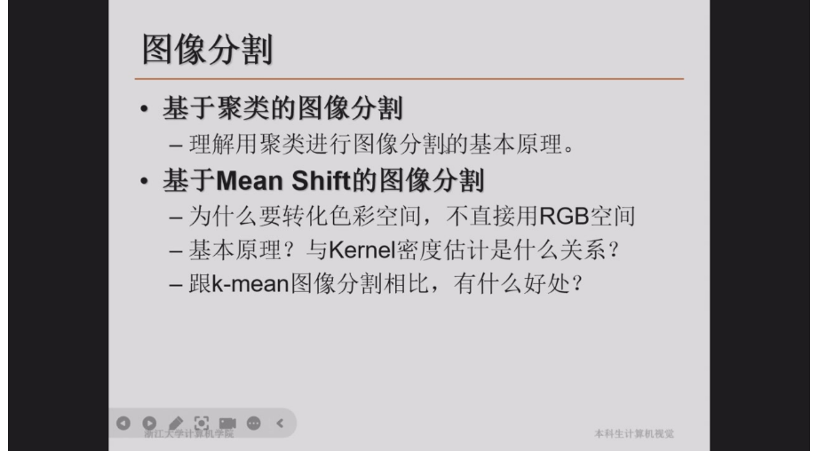

### 基于聚类的图像分割

* **理解用聚类进行图像分割的基本原理。**
    * **基本原理**：这种方法的核心思想是将图像分割问题**转化为一个聚类问题**。它将图像中的**每一个像素**看作是高维特征空间中的一个**数据点**。然后，使用聚类算法（如 K-Means、Mean Shift 等）将这些数据点进行分组。
    * **特征空间**：每个像素点可以由不同的特征来描述，最常见的特征是：
        1.  **颜色**：例如 `(R, G, B)` 三个通道的值。
        2.  **颜色 + 空间位置**：例如 `(L, a, b, x, y)` 五个维度的值，其中 `(L,a,b)` 是颜色信息，`(x, y)` 是像素在图像中的坐标。
    * **分割过程**：聚类算法会自动将特征相似的像素点（数据点）分到同一个“簇”（cluster）中。最终，所有属于同一个簇的像素就被认为是图像中的同一个分割区域，并可以被赋予相同的颜色（如该簇的平均颜色）以实现可视化。

### 基于Mean Shift的图像分割

这部分详细探讨了 Mean Shift 算法在图像分割中的应用细节和优势。

* **为什么要去转化色彩空间，不直接用RGB空间**
    * **核心原因**：**RGB 空间不符合人类的视觉感知**。在 RGB 空间中，两个颜色之间的欧氏距离大小，并不能很好地反映出人类眼睛感觉到的这两种颜色的差异大小。
    * **举例**：两种色调相近但明暗不同的绿色，在RGB空间中的距离可能非常大；而一种绿色和一种青色，在RGB空间中的距离可能反而更小，但这在人看来是两种完全不同的颜色。
    * **解决方案**：转换到**感知上更均匀**的色彩空间，如 **L\*a\*b\* 或 L\*u\*v\***。
        * 在这些空间中，两点间的欧氏距离与人眼感知的颜色差异**成正比**。
        * 此外，`L*` 分量代表**亮度**，`a*` 和 `b*` 分量代表**色彩**，将亮度和色彩分离，可以使算法对光照变化不那么敏感。
    * **结论**：使用 L\*a\*b\* 空间进行聚类，能让“距离近”的像素在视觉上也“看起来像”，分割结果更符合直觉。

* **基本原理？与Kernel密度估计是什么关系？**
    * **基本原理**：Mean Shift 是一种**寻找数据密度峰值（mode）**的算法。它从每个点开始，迭代地将搜索窗口的中心移动到窗口内数据点的“重心”位置，这个移动方向就是**密度增加最快**的方向。最终，窗口会收敛到某个密度峰值点。所有收敛到同一个峰值的点被归为一类。
    * **与核密度估计 (Kernel Density Estimation, KDE) 的关系**：两者关系非常密切。
        * **KDE** 是一种估计数据概率密度函数的方法。它通过在每个数据点上放置一个“核函数”（如高斯函数）并求和，来创建一个平滑的“密度地形图”。
        * **Mean Shift** 算法可以被严格证明是**在这个密度地形图上进行“爬山”**的过程。Mean Shift 向量的方向，正比于该点**密度函数的梯度方向**。因此，沿着 Mean Shift 向量移动，就是在进行**梯度上升**，最终必然会到达一个山峰（即密度峰值）。
        * **简单说**：KDE 负责构建“密度山脉”，而 Mean Shift 负责找到并爬上这些“山峰”。

* **跟k-mean图像分割相比，有什么好处？**
    1.  **无需预先指定聚类数量 `K`**：这是最大的优点。K-Means 必须由用户指定最终要分成几类，而这个数量往往是未知的。Mean Shift 则会根据数据本身的分布，**自动发现**其中存在的类别数量。
    2.  **可以发现任意形状的簇**：K-Means 假设簇是球形的，因为它试图最小化到质心的距离。而 Mean Shift 是基于密度的，它可以沿着数据的密度梯度，发现各种不规则形状的簇。
    3.  **对离群点不敏感**：离群点通常位于低密度区域，它们不会形成自己的密度峰值，也不会对主流的“山峰”位置产生太大影响。而在 K-Means 中，离群点会显著地拖拽质心的位置。

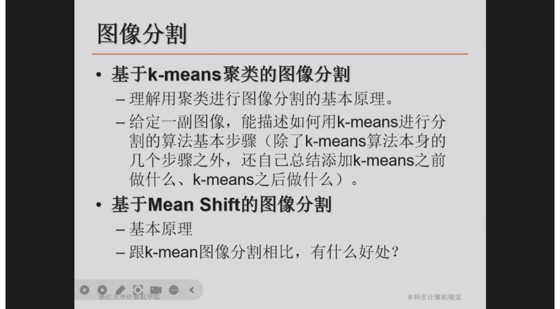
好的，我们来继续解读这份关于**图像分割 (Image Segmentation)** 的课程复习幻灯片。

这张幻灯片对比了两种基于聚类的经典图像分割方法：K-Means 和 Mean Shift。

---
### 基于k-means聚类的图像分割

* **理解用聚类进行图像分割的基本原理。**
    这与上一张幻灯片的内容一致。基本原理是：将图像中的每个**像素**视为一个数据点，其特征可以是**颜色值**（如RGB）或**颜色+空间位置**（如L,a,b,x,y）。通过聚类算法将特征相似的像素点分到同一个簇中，从而实现将图像分割成不同区域的目的。

* **给定一副图像，能描述如何用k-means进行分割的算法基本步骤（除了k-means算法本身的几个步骤之外，还自己总结添加k-means之前做什么、k-means之后做什么）。**
    这是一个非常实践性的问题，要求描述一个完整的处理**流水线（pipeline）**。

    #### **1. K-Means之前 (预处理)**
    * **选择特征空间**：首先要决定根据什么来进行聚类。最简单的是只用颜色`(R, G, B)`。为了让结果更符合人类视觉，通常会转换到**L\*a\*b\*色彩空间**。如果想让位置相近的像素更容易被聚在一起，可以加入坐标信息，构成五维特征`(L, a, b, x, y)`。
    * **数据重塑 (Reshape)**：将`高度 × 宽度 × 通道数`的三维图像数据，“压平”成一个`（高度×宽度）× 通道数`的二维表格。这样，**每一行代表一个像素，每一列代表一个特征**。这是K-Means算法需要的输入格式。

    #### **2. 执行K-Means算法**
    * **初始化**：**指定聚类的数量 `k`**（即你希望将图像分割成几个区域），并随机初始化 `k` 个聚类中心（质心）。
    * **分配步骤 (Assignment)**：对于每一个像素点，计算它与 `k` 个质心的距离，并将它分配给距离最近的那个质心所属的簇。
    * **更新步骤 (Update)**：重新计算每个簇的质心，即取簇内所有像素点的特征向量的平均值作为新的质心。
    * **迭代**：重复执行“分配”和“更新”这两个步骤，直到质心的位置不再有明显变化，或者达到预设的最大迭代次数。

    #### **3. K-Means之后 (后处理)**
    * **标签映射**：K-Means运行结束后，每个像素点都会被分配一个簇的标签（例如，从0到k-1）。
    * **图像重建**：创建一个新的空白图像。根据每个像素的标签，用其所属簇的**最终质心颜色**来填充该像素。
    * **恢复形状 (Reshape)**：将填充好颜色的一维像素数据，恢复成原始图像的`高度 × 宽度 × 通道数`的尺寸，最终得到分割后的图像。